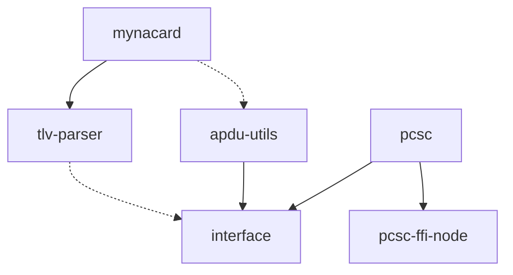

# Contributing to jsapdu

Thank you for your interest in contributing to jsapdu! This guide will help you get started with development, testing, and submitting contributions.

## Table of Contents

- [Getting Started](#getting-started)
- [Development Setup](#development-setup)
- [Project Structure](#project-structure)
- [Development Workflow](#development-workflow)
- [Testing](#testing)
- [Code Style](#code-style)
- [Submitting Changes](#submitting-changes)
- [Adding New Features](#adding-new-features)
- [Documentation Guidelines](#documentation-guidelines)
- [Release Process](#release-process)

## Getting Started

### Prerequisites

- **Node.js**: Version 18 or higher
- **npm**: Version 9 or higher
- **PC/SC**: Smart card reader support
  - Windows: Included with OS
  - macOS: Included with OS
  - Linux: `sudo apt-get install libpcsclite-dev`
- **Git**: For version control
- **TypeScript**: For development

### Fork and Clone

1. Fork the repository on GitHub
2. Clone your fork locally:
   ```bash
   git clone https://github.com/YOUR_USERNAME/jsapdu.git
   cd jsapdu
   ```

3. Add the upstream remote:
   ```bash
   git remote add upstream https://github.com/AokiApp/jsapdu.git
   ```

## Development Setup

### Install Dependencies

```bash
# Install root dependencies and bootstrap packages
npm install

# Build all packages
npm run build
```

### Verify Setup

```bash
# Run tests to ensure everything works
npm test

# Check linting
npm run lint

# Format code
npm run format
```

## Project Structure

```
jsapdu/
├── packages/                    # Monorepo packages
│   ├── interface/              # Core abstractions
│   ├── pcsc/                   # PC/SC implementation  
│   ├── pcsc-ffi-node/          # Native PC/SC bindings
│   ├── apdu-utils/             # APDU utilities
│   ├── tlv-parser/             # TLV data parsing
│   └── mynacard/               # Japanese MynaCard support
├── examples/                   # Usage examples
│   ├── mynacard/               # MynaCard examples
│   ├── pcsc-ffi/              # Low-level examples
│   ├── smartcard-mcp/         # MCP server example
│   └── mynacard-e2e/          # End-to-end tests
├── docs/                      # Documentation
│   ├── api/                   # API reference
│   ├── guides/                # User guides
│   ├── architecture/          # Architecture docs
│   └── examples/              # Example documentation
├── package.json               # Root package configuration
├── turbo.json                 # Turbo build configuration
└── eslint.config.mjs          # ESLint configuration
```

### Package Dependencies



## Development Workflow

### Create a Feature Branch

```bash
# Update your main branch
git checkout main
git pull upstream main

# Create a feature branch
git checkout -b feature/your-feature-name
```

### Make Changes

1. **Follow the coding standards** (see [Code Style](#code-style))
2. **Write tests** for new functionality
3. **Update documentation** as needed
4. **Test your changes** thoroughly

### Commit Guidelines

We use conventional commit messages:

```bash
# Format: type(scope): description
git commit -m "feat(pcsc): add reader state monitoring"
git commit -m "fix(apdu-utils): handle extended APDU length correctly"
git commit -m "docs(mynacard): add PIN management examples"
```

**Types:**
- `feat`: New feature
- `fix`: Bug fix
- `docs`: Documentation only
- `style`: Code style changes (formatting, etc.)
- `refactor`: Code refactoring
- `test`: Adding or updating tests
- `chore`: Maintenance tasks

**Scopes:**
- `interface`: Core abstractions
- `pcsc`: PC/SC implementation
- `apdu-utils`: APDU utilities
- `tlv-parser`: TLV parsing
- `mynacard`: MynaCard support
- `docs`: Documentation
- `examples`: Example code

## Testing

### Running Tests

```bash
# Run all tests
npm test

# Run tests for specific package
npm run test --workspace=@aokiapp/interface

# Run tests in watch mode
npm run test:watch

# Run end-to-end tests (requires hardware)
npm run test:e2e
```

### Test Structure

```
packages/PACKAGE_NAME/
├── src/
│   └── *.ts                   # Source files
├── tests/
│   ├── *.test.ts             # Unit tests
│   └── fixtures/             # Test data
└── package.json
```

### Writing Tests

```typescript
import { describe, it, expect, beforeEach, afterEach } from 'vitest';
import { CommandApdu } from '../src/index.js';

describe('CommandApdu', () => {
  it('should create valid APDU command', () => {
    const apdu = new CommandApdu(0x00, 0xa4, 0x04, 0x00, null, 0x00);
    
    expect(apdu.cla).toBe(0x00);
    expect(apdu.ins).toBe(0xa4);
    expect(apdu.p1).toBe(0x04);
    expect(apdu.p2).toBe(0x00);
  });

  it('should serialize to correct byte array', () => {
    const apdu = new CommandApdu(0x00, 0xa4, 0x04, 0x00, null, 0x00);
    const bytes = apdu.toUint8Array();
    
    expect(bytes).toEqual(new Uint8Array([0x00, 0xa4, 0x04, 0x00, 0x00]));
  });
});
```

### Hardware Testing

For tests requiring SmartCard hardware:

```typescript
import { describe, it, expect, beforeAll, afterAll } from 'vitest';
import { PcscPlatformManager } from '@aokiapp/pcsc';

describe('Hardware Tests', () => {
  let platform;
  let device;
  let card;

  beforeAll(async () => {
    // Setup hardware connection
    const manager = PcscPlatformManager.getInstance();
    platform = manager.getPlatform();
    await platform.init();
    
    const devices = await platform.getDeviceInfo();
    if (devices.length === 0) {
      throw new Error('No card readers found for testing');
    }
    
    device = await platform.acquireDevice(devices[0].id);
    if (!(await device.isCardPresent())) {
      throw new Error('No card present for testing');
    }
    
    card = await device.startSession();
  });

  afterAll(async () => {
    // Cleanup
    await card?.release();
    await device?.release();
    await platform?.release();
  });

  it('should read card ATR', async () => {
    const atr = await card.getAtr();
    expect(atr.length).toBeGreaterThan(0);
  });
});
```

## Code Style

### TypeScript Guidelines

- Use strict TypeScript configuration
- Prefer explicit types over `any`
- Use meaningful variable and function names
- Add JSDoc comments for public APIs

```typescript
/**
 * Establishes a connection to a SmartCard platform
 * @param platformType - The type of platform to connect to
 * @returns Promise that resolves to the platform instance
 * @throws {SmartCardError} When platform initialization fails
 */
async function connectToPlatform(platformType: string): Promise<SmartCardPlatform> {
  // Implementation
}
```

### Error Handling

Always use structured error handling:

```typescript
// ✅ Good
try {
  const result = await card.transmit(command);
  return result;
} catch (error) {
  throw new SmartCardError(
    "TRANSMISSION_ERROR",
    "Failed to transmit APDU command",
    error instanceof Error ? error : undefined
  );
}

// ❌ Avoid
try {
  return await card.transmit(command);
} catch (error) {
  throw error; // Loses context
}
```

### Resource Management

Always use proper resource cleanup:

```typescript
// ✅ Preferred - automatic cleanup
async function example() {
  await using platform = manager.getPlatform();
  await using device = await platform.acquireDevice(deviceId);
  await using card = await device.startSession();
  
  // Use card...
  // Resources automatically cleaned up
}

// ✅ Acceptable - manual cleanup
async function example() {
  let platform, device, card;
  
  try {
    platform = manager.getPlatform();
    await platform.init();
    
    device = await platform.acquireDevice(deviceId);
    card = await device.startSession();
    
    // Use card...
  } finally {
    await card?.release();
    await device?.release();  
    await platform?.release();
  }
}
```

### Linting and Formatting

Code is automatically formatted and linted:

```bash
# Check formatting and style
npm run lint

# Auto-fix issues
npm run lint --fix

# Format code
npm run format
```

Configuration files:
- ESLint: `eslint.config.mjs`
- Prettier: `.prettierrc`
- TypeScript: `tsconfig.json` (per package)

## Submitting Changes

### Pull Request Process

1. **Ensure tests pass**:
   ```bash
   npm test
   npm run lint
   npm run build
   ```

2. **Update documentation** if needed

3. **Create pull request**:
   - Use a descriptive title
   - Reference any related issues
   - Describe the changes made
   - Include testing instructions

4. **Respond to feedback** from maintainers

### Pull Request Template

```markdown
## Description
Brief description of the changes made.

## Type of Change
- [ ] Bug fix
- [ ] New feature
- [ ] Breaking change
- [ ] Documentation update

## Testing
- [ ] Unit tests added/updated
- [ ] Integration tests added/updated
- [ ] Manual testing performed

## Checklist
- [ ] Code follows style guidelines
- [ ] Self-review completed
- [ ] Comments added to complex code
- [ ] Documentation updated
- [ ] No new warnings introduced
```

## Adding New Features

### New Platform Support

To add support for a new SmartCard platform:

1. **Create platform package**:
   ```bash
   mkdir packages/your-platform
   cd packages/your-platform
   npm init
   ```

2. **Implement abstractions**:
   ```typescript
   import { SmartCardPlatform, SmartCardDevice, SmartCard } from '@aokiapp/interface';
   
   export class YourPlatform extends SmartCardPlatform {
     async init(): Promise<void> {
       // Initialize platform
     }
     
     async getDeviveInfo(): Promise<SmartCardDeviceInfo[]> {
       // Get available devices
     }
     
     // Implement other required methods
   }
   ```

3. **Add tests and documentation**

4. **Update main README** and documentation

### New Card Type Support

To add support for a new SmartCard type:

1. **Define constants**:
   ```typescript
   // Application Identifier
   export const YOUR_CARD_AP = [0x01, 0x02, 0x03, 0x04];
   
   // Elementary Files
   export const YOUR_CARD_AP_EF = {
     FILE1: 0x01,
     FILE2: 0x02,
   } as const;
   ```

2. **Create TLV schemas**:
   ```typescript
   export const schemaYourCardData = Schema.constructed("yourCardData", [
     Schema.primitive("field1", decoder1),
     Schema.primitive("field2", decoder2)
   ]);
   ```

3. **Add utility functions**:
   ```typescript
   export async function readYourCardData(card: SmartCard, pin: string) {
     // Implementation
   }
   ```

4. **Write comprehensive tests**

5. **Document usage patterns**

### New APDU Utilities

To add new APDU utility functions:

1. **Implement function**:
   ```typescript
   export function yourCommand(
     param1: number,
     param2: string,
     options?: YourCommandOptions
   ): CommandApdu {
     // Validate parameters
     // Build and return CommandApdu
   }
   ```

2. **Add parameter validation**:
   ```typescript
   if (param1 < 0 || param1 > 255) {
     throw new Error("Invalid parameter range");
   }
   ```

3. **Write comprehensive tests**:
   ```typescript
   describe('yourCommand', () => {
     it('should create correct APDU', () => {
       const cmd = yourCommand(0x01, "test");
       expect(cmd.toUint8Array()).toEqual(expectedBytes);
     });
     
     it('should validate parameters', () => {
       expect(() => yourCommand(-1, "test")).toThrow();
     });
   });
   ```

## Documentation Guidelines

### API Documentation

- Use JSDoc for all public APIs
- Include parameter types and descriptions
- Provide usage examples
- Document error conditions

```typescript
/**
 * Creates a SELECT command for directory files (applications)
 * 
 * @param aid - Application Identifier (1-16 bytes)
 * @param requestFci - Whether to request File Control Information
 * @returns CommandApdu ready for transmission
 * @throws {Error} When AID length is invalid
 * 
 * @example
 * ```typescript
 * const cmd = selectDf("A0000000041010", true);
 * const response = await card.transmit(cmd);
 * ```
 */
function selectDf(aid: string | number[] | Uint8Array, requestFci = false): CommandApdu {
  // Implementation
}
```

### README Updates

When adding new packages or features:

1. Update the main README
2. Update package-specific READMEs  
3. Add to API documentation
4. Include in guides as appropriate

### Example Code

Provide complete, runnable examples:

```typescript
// ✅ Good - complete example
import { PcscPlatformManager } from "@aokiapp/pcsc";
import { selectDf } from "@aokiapp/apdu-utils";

async function example() {
  const manager = PcscPlatformManager.getInstance();
  await using platform = manager.getPlatform();
  await platform.init();
  
  const devices = await platform.getDeviceInfo();
  await using device = await platform.acquireDevice(devices[0].id);
  await using card = await device.startSession();
  
  const response = await card.transmit(selectDf("A0000000041010"));
  console.log("Success:", response.sw === 0x9000);
}

example().catch(console.error);
```

## Release Process

### Version Management

- We use semantic versioning (semver)
- Versions are managed at the workspace level
- Breaking changes require major version bump

### Release Checklist

1. **Update version numbers**
2. **Update CHANGELOG.md**
3. **Run full test suite**
4. **Build all packages**
5. **Tag release**
6. **Publish to npm**

### Changelog Format

```markdown
## [1.1.0] - 2024-01-15

### Added
- New platform support for WebUSB
- Additional APDU utility functions

### Changed
- Improved error messages for PIN verification
- Updated TypeScript to version 5.0

### Fixed
- Memory leak in PC/SC device cleanup
- TLV parsing for edge cases

### Deprecated
- Old platform initialization method

### Removed
- Support for Node.js 16

### Security
- Enhanced PIN handling security
```

## Getting Help

### Resources

- **Documentation**: Check [docs/](../docs/) directory
- **Examples**: Look at [examples/](../examples/) directory
- **API Reference**: See [docs/api/](../docs/api/) directory
- **Issues**: Search existing [GitHub issues](https://github.com/AokiApp/jsapdu/issues)

### Community

- **GitHub Discussions**: For questions and ideas
- **Issues**: For bug reports and feature requests
- **Pull Requests**: For code contributions

### Maintainer Contact

For questions about contributing, reach out to the maintainers through:
- GitHub issues (preferred)
- GitHub discussions
- Email: [contact information]

## Code of Conduct

This project follows the [Contributor Covenant Code of Conduct](CODE_OF_CONDUCT.md). By participating, you are expected to uphold this code.

## License

By contributing to jsapdu, you agree that your contributions will be licensed under the same [AokiApp Normative Application License](../LICENSE.md) (ANAL) as the project.

Currently we are not accepting open contributions to the codebase without prior approval. But we are open to approving contributions on a case-by-case basis. Please feel free to reach out via Email.

Thank you for contributing to jsapdu! 🎉