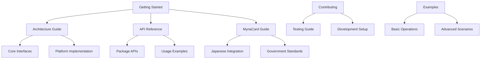

# jsapdu Documentation

**The modern TypeScript library for SmartCard communication**

## 🚀 Quick Start

New to jsapdu? Start here:

- **[Getting Started](./getting-started.md)** - Installation, basic setup, and first examples
- **[Quick Examples](#quick-examples)** - Common usage patterns
- **[Architecture Overview](./architecture/README.md)** - Understanding jsapdu's design

## 📚 Documentation Structure

### Core Documentation

| Document                                           | Description                  | Audience                        |
| -------------------------------------------------- | ---------------------------- | ------------------------------- |
| **[Getting Started](./getting-started.md)**        | Installation and basic usage | All developers                  |
| **[Architecture Guide](./architecture/README.md)** | System design and patterns   | Architects, advanced developers |
| **[API Reference](./api/README.md)**               | Complete API documentation   | All developers                  |

### Implementation Guides

| Guide                                            | Description                           | Use Case            |
| ------------------------------------------------ | ------------------------------------- | ------------------- |
| **[MynaCard Guide](./guides/mynacard.md)**       | Japanese government ID integration    | MynaCard developers |
| **[Testing Guide](./guides/testing.md)**         | Testing strategies and best practices | All developers      |
| **[Error Handling](./guides/error-handling.md)** | Comprehensive error management        | All developers      |

### Developer Resources

| Resource                                    | Description                          | Audience       |
| ------------------------------------------- | ------------------------------------ | -------------- |
| **[Contributing Guide](./CONTRIBUTING.md)** | Development workflow and standards   | Contributors   |
| **[Examples](./examples/README.md)**        | Real-world usage examples            | All developers |
| **[Package Naming](../PACKAGE_NAMING.md)**  | Package organization recommendations | Maintainers    |

## 🏗️ Package Documentation

Each package has detailed README documentation:

### Core Packages

- **[@aokiapp/jsapdu-interface](../packages/interface/README.md)** - Core abstractions and types
- **[@aokiapp/jsapdu-pcsc](../packages/pcsc/README.md)** - PC/SC platform implementation
- **[@aokiapp/apdu-utils](../packages/apdu-utils/README.md)** - APDU command utilities

### Specialized Packages

- **[@aokiapp/mynacard](../packages/mynacard/README.md)** - Japanese MynaCard support
- **[@aokiapp/tlv-parser](../packages/tlv-parser/README.md)** - TLV data parsing
- **[@aokiapp/pcsc-ffi-node](../packages/pcsc-ffi-node/README.md)** - Native PC/SC bindings

## 💡 Quick Examples

### Basic Card Connection

```typescript
import { PcscPlatformManager } from "@aokiapp/jsapdu-pcsc";

const manager = PcscPlatformManager.getInstance();
await using platform = manager.getPlatform();
await platform.init();

const devices = await platform.getDeviceInfo();
await using device = await platform.acquireDevice(devices[0].id);
await using card = await device.startSession();
```

### MynaCard Basic Information

```typescript
import {
  KENHOJO_AP,
  KENHOJO_AP_EF,
  schemaKenhojoBasicFour,
} from "@aokiapp/mynacard";
import { selectDf, verify, readEfBinaryFull } from "@aokiapp/apdu-utils";
import { SchemaParser } from "@aokiapp/tlv-parser";

await card.transmit(selectDf(KENHOJO_AP));
await card.transmit(verify("1234", { ef: KENHOJO_AP_EF.PIN }));
const data = await card.transmit(readEfBinaryFull(KENHOJO_AP_EF.BASIC_FOUR));

const parser = new SchemaParser(schemaKenhojoBasicFour);
const info = parser.parse(data.arrayBuffer());
console.log("Name:", info.name, "Address:", info.address);
```

### Error Handling

```typescript
import { SmartCardError } from "@aokiapp/jsapdu-interface";

try {
  await card.transmit(command);
} catch (error) {
  if (error instanceof SmartCardError) {
    switch (error.code) {
      case "CARD_NOT_PRESENT":
        console.log("Please insert a card");
        break;
      case "TIMEOUT":
        console.log("Operation timed out");
        break;
      default:
        console.log("Error:", error.getSafeMessage());
    }
  }
}
```

## 🔗 Navigation Map



## 🎯 Find What You Need

### I want to...

#### **Get Started**

- [Install and setup jsapdu](./getting-started.md#installation)
- [Connect to my first SmartCard](./getting-started.md#your-first-smartcard-connection)
- [Understand the architecture](./architecture/README.md)

#### **Build Applications**

- [Work with MynaCard](./guides/mynacard.md) (Japanese government ID)
- [Handle errors properly](./guides/error-handling.md)
- [Build APDU commands](../packages/apdu-utils/README.md)
- [Parse TLV data](../packages/tlv-parser/README.md)

#### **Platform Integration**

- [Use PC/SC readers](../packages/pcsc/README.md)
- [Access native PC/SC APIs](../packages/pcsc-ffi-node/README.md)
- [Implement new platforms](./guides/extending-platforms.md)

#### **Development & Testing**

- [Set up development environment](./CONTRIBUTING.md#development-setup)
- [Write tests](./guides/testing.md)
- [Contribute to the project](./CONTRIBUTING.md)

#### **Reference & Troubleshooting**

- [Complete API reference](./api/README.md)
- [Common error codes](./guides/error-handling.md#error-codes)
- [Troubleshooting guide](./guides/troubleshooting.md)

## 📋 Documentation Standards

This documentation follows these principles:

- **Clarity First**: Easy to understand explanations
- **Example-Rich**: Practical, runnable code examples
- **Cross-Referenced**: Easy navigation between related topics
- **Audience-Aware**: Content tailored to different skill levels
- **Bilingual Support**: Japanese terms explained for MynaCard

## 🤝 Getting Help

- **Documentation Issues**: [GitHub Issues](https://github.com/AokiApp/jsapdu/issues)
- **Feature Requests**: [GitHub Discussions](https://github.com/AokiApp/jsapdu/discussions)
- **Contributing**: See [Contributing Guide](./CONTRIBUTING.md)

---

**Next Steps**: [Get Started →](./getting-started.md) | [View Examples →](./examples/README.md) | [API Reference →](./api/README.md)
