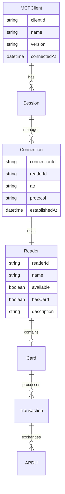

# スマートカードMCPサーバ基本仕様書

**文書番号:** SCMCP-BAS-001  
**版数:** 1.0  
**作成日:** 2025年7月16日  
**作成者:** システム企画チーム  
**承認者:** [承認者名]  

---

## 改訂履歴

| 版数 | 改訂日 | 改訂者 | 改訂内容 |
|------|--------|--------|----------|
| 1.0 | 2025/07/16 | システム企画チーム | 初版作成 |

---

## 1. 文書概要

### 1.1 文書の目的
本文書は、スマートカードModel Context Protocol（MCP）サーバシステムの基本仕様を定めるものである。本システムは、AIエージェントがスマートカードハードウェアと統一的なインターフェースを通じて連携するための基盤システムを提供する。

### 1.2 文書の位置づけ
本文書は、システム開発における基本設計フェーズの成果物であり、詳細設計および実装の基礎となる仕様を記述する。

### 1.3 対象読者
- プロジェクトマネージャー
- システムアーキテクト
- システム設計者
- 開発者

### 1.4 関連文書
- スマートカードMCPサーバ要件定義書 (SCMCP-REQ-001)
- スマートカードMCPサーバ詳細仕様書 (SCMCP-DET-001)

---

## 2. システム概要

### 2.1 システムの目的
本システムは、以下の目的を達成するために開発される：

1. **AIエージェント連携**: Claude、ChatGPT等のAIエージェントがスマートカードを操作可能とする
2. **標準化されたインターフェース**: カード種別に依存しない汎用的な操作インターフェースを提供
3. **セキュアな通信**: スマートカードとの安全な通信チャネルを確立
4. **運用効率化**: 従来の個別対応から統一的な操作環境への移行

### 2.2 システムの特徴

#### 2.2.1 カード非依存性
- ISO 7816準拠のスマートカード全般をサポート
- 特定ベンダー・カード種別への依存を排除
- 将来的な新カード対応の容易性を確保

#### 2.2.2 高可用性アーキテクチャ
- FastMCPフレームワークによる堅牢な基盤
- 自動リソース管理によるメモリリーク防止
- FastMCPのセッション管理による安定した通信環境

#### 2.2.3 マルチリーダー対応
- 複数カードリーダーの同時利用
- リーダー間の排他制御
- 動的なリーダー追加・削除への対応

### 2.3 システム構成

```
┌─────────────────────────────────────────────────────┐
│                  ユーザー層                          │
│  ┌─────────────┐ ┌─────────────┐ ┌─────────────┐  │
│  │   Claude    │ │  ChatGPT    │ │   その他    │  │
│  └─────────────┘ └─────────────┘ └─────────────┘  │
└─────────────────────────────────────────────────────┘
                        │
              MCP Protocol (JSON-RPC 2.0)
                        │
┌─────────────────────────────────────────────────────┐
│            アプリケーション層                        │
│  ┌─────────────────────────────────────────────┐   │
│  │      スマートカードMCPサーバ                │   │
│  │                                           │   │
│  │  ┌─────────┐ ┌─────────┐ ┌─────────┐    │   │
│  │  │ツール   │ │セッション│ │エラー   │    │   │
│  │  │マネージャ│ │マネージャ│ │ハンドラ │    │   │
│  │  └─────────┘ └─────────┘ └─────────┘    │   │
│  └─────────────────────────────────────────────┘   │
└─────────────────────────────────────────────────────┘
                        │
              @aokiapp Interface Layer
                        │
┌─────────────────────────────────────────────────────┐
│              ミドルウェア層                          │
│  ┌─────────────────────────────────────────────┐   │
│  │            PC/SC サブシステム               │   │
│  └─────────────────────────────────────────────┘   │
└─────────────────────────────────────────────────────┘
                        │
                  OS PC/SC Service
                        │
┌─────────────────────────────────────────────────────┐
│               ハードウェア層                         │
│  ┌─────────────┐ ┌─────────────┐ ┌─────────────┐  │
│  │ USB リーダー │ │ NFC リーダー │ │内蔵リーダー │  │
│  └─────────────┘ └─────────────┘ └─────────────┘  │
└─────────────────────────────────────────────────────┘
```

---

## 3. 機能概要

### 3.1 提供機能一覧

| 機能分類 | 機能名 | 概要説明 | 重要度 |
|----------|--------|----------|--------|
| リーダー管理 | リーダー一覧取得 | システム接続中のカードリーダー情報を取得 | ★★★ |
| セッション管理 | カード接続 | FastMCPのセッション管理で指定リーダーのカードと接続 | ★★★ |
| セッション管理 | カード切断 | FastMCPのセッション管理で安全に切断 | ★★★ |
| 通信機能 | APDU送信 | カードへのコマンド送信と応答受信 | ★★★ |
| カード制御 | カードリセット | ハードウェアレベルでのカード初期化 | ★★☆ |
| 支援機能 | ステータス解釈 | APDUステータスコードの意味解釈 | ★★☆ |
| 保守機能 | 強制リーダー解放 | 異常状態リーダーの強制リソース解放 | ★☆☆ |

### 3.2 機能詳細

#### 3.2.1 リーダー管理機能

**目的:** システムに接続されているスマートカードリーダーの状態を管理する

**主要機能:**
- リーダー自動検出
- リーダー状態監視
- カード挿入状態確認
- リーダー属性情報提供

**利用シーン:**
- システム初期化時のリーダー確認
- 利用可能リーダーの選択
- システム状態のヘルスチェック

#### 3.2.2 セッション管理機能

**目的:** FastMCPのセッション管理（context.session）により、スマートカードとの通信状態をクライアントごとに安全に管理する

**主要機能:**
- FastMCPのセッションごとにカード接続状態を管理
- 排他制御による競合回避
- セッション状態の自動追跡・自動クリーンアップ

**利用シーン:**
- カード操作開始時の接続確立（context.sessionに保存）
- 操作完了時の安全な切断（自動クリーンアップ）
- 異常終了時の自動復旧

#### 3.2.3 通信機能

**目的:** スマートカードとの低レベル通信を抽象化して提供する

**主要機能:**
- APDU コマンド構築
- カード送信・応答受信
- プロトコル自動判定
- 実行時間測定

**利用シーン:**
- カード内データの読み取り
- カードへのデータ書き込み
- 認証処理の実行
- カード機能の呼び出し

### 3.3 データ流れ図

```mermaid
flowchart TD
    A[AIエージェント] -->|MCPリクエスト| B[FastMCPサーバ]
    B -->|ツール実行| C[ツールハンドラ]
    C -->|プラットフォーム操作| D[@aokiapp/pcsc]
    D -->|PC/SC API| E[PC/SCサービス]
    E -->|ハードウェア制御| F[カードリーダー]
    F -->|APDU通信| G[スマートカード]
    
    G -->|応答| F
    F -->|データ| E
    E -->|結果| D
    D -->|構造化データ| C
    C -->|レスポンス| B
    B -->|MCP応答| A
```

---

## 4. アーキテクチャ設計

### 4.1 アーキテクチャ原則

#### 4.1.1 階層化アーキテクチャ
- **表現層**: MCPプロトコル処理
- **ビジネス層**: スマートカード操作ロジック
- **データアクセス層**: PC/SCインターフェース
- **インフラ層**: OS・ハードウェア

#### 4.1.2 責務分離
- **FastMCPフレームワーク**: プロトコル処理、セッション管理
- **ツールレイヤー**: ビジネスロジック実装
- **@aokiappライブラリ**: ハードウェア抽象化
- **PC/SCミドルウェア**: OS標準サービス

#### 4.1.3 拡張性設計
- プラグイン可能なツール構成
- 引数ベースの柔軟な設定
- 新カード種別への対応容易性

### 4.2 コンポーネント構成

#### 4.2.1 コアコンポーネント

| コンポーネント名 | 責務 | 依存関係 |
|------------------|------|----------|
| FastMCPServer | MCPプロトコル処理、HTTP/stdio転送 | FastMCPフレームワーク |
| ToolRegistry | ツール登録・実行管理 | Zodスキーマ検証 |
| ErrorHandler | エラー変換・ハンドリング | UserErrorクラス |
| PlatformManager | PC/SCプラットフォーム管理 | @aokiapp/pcsc |

#### 4.2.2 補助コンポーネント

| コンポーネント名 | 責務 | 依存関係 |
|------------------|------|----------|
| ArgumentParser | 引数解析 | コマンドライン引数 |
| LogManager | ログ出力管理 | FastMCPログ機能 |
| HealthChecker | システム状態監視 | 各コンポーネント |
| AuthManager | 認証・認可処理 | OAuth/APIキー |

### 4.3 データモデル

#### 4.3.1 エンティティ関連図



#### 4.3.2 主要データ構造

**ReaderInfo構造体**
```typescript
interface ReaderInfo {
  id: string;                    // リーダー一意識別子
  name: string;                  // リーダー表示名
  description: string;           // リーダー詳細説明
  isAvailable: boolean;          // 利用可能状態
  hasCard: boolean;              // カード挿入状態
  isIntegrated: boolean;         // 内蔵型フラグ
  isRemovable: boolean;          // 取り外し可能フラグ
  supportsApdu: boolean;         // APDU対応フラグ
  supportsHce: boolean;          // HCE対応フラグ
}
```

**SessionInfo構造体**
```typescript
interface CardConnectionInfo {
  readerId: string;             // 使用リーダーID
  atr: string;                  // Answer to Reset
  protocol: ProtocolType;       // 通信プロトコル
  connectedAt: Date;            // 接続確立日時
  lastActivity: Date;           // 最終アクティビティ日時
}
```

---

## 5. インターフェース設計

### 5.1 外部インターフェース

#### 5.1.1 MCPプロトコルインターフェース

**プロトコル仕様:**
- ベースプロトコル: JSON-RPC 2.0
- 転送方式: stdio / HTTP Streaming
- 認証方式: APIキー / OAuth 2.0

**メッセージ形式:**
```json
{
  "jsonrpc": "2.0",
  "method": "tools/call",
  "params": {
    "name": "toolName",
    "arguments": { ... }
  },
  "id": "request-id"
}
```

#### 5.1.2 コマンドライン引数

**基本引数**
```bash
# 基本設定
--transport-type=stdio|httpStream
--port=8080
--log-level=debug|info|warn|error

# スマートカード設定
--smartcard-timeout=30000
--max-sessions=10

# 認証設定
--auth-enabled=true|false
--auth-type=apiKey|oauth
--api-key=your-api-key
```

### 5.2 内部インターフェース

#### 5.2.1 ツールインターフェース

**ツール定義テンプレート**
```typescript
interface ToolDefinition {
  name: string;                 // ツール名
  description: string;          // ツール説明
  parameters: ZodSchema;        // 入力スキーマ
  annotations: ToolAnnotations; // メタデータ
  execute: ToolExecutor;        // 実行関数
}

interface ToolAnnotations {
  title?: string;               // UI表示名
  readOnlyHint?: boolean;       // 読み取り専用フラグ
  destructiveHint?: boolean;    // 破壊的操作フラグ
  idempotentHint?: boolean;     // 冪等性フラグ
  openWorldHint?: boolean;      // 外部リソース利用フラグ
}
```

#### 5.2.2 エラーハンドリングインターフェース

**エラー分類体系**
```typescript
enum ErrorCategory {
  SYSTEM_ERROR = "system",      // システムレベルエラー
  HARDWARE_ERROR = "hardware",  // ハードウェアエラー
  PROTOCOL_ERROR = "protocol",  // プロトコルエラー
  VALIDATION_ERROR = "validation", // 入力検証エラー
  BUSINESS_ERROR = "business"   // ビジネスロジックエラー
}

interface ErrorInfo {
  code: string;                 // エラーコード
  category: ErrorCategory;      // エラー分類
  message: string;              // エラーメッセージ
  details?: Record<string, any>; // 詳細情報
  recovery?: string;            // 回復方法
}
```

---

## 6. セキュリティ設計

### 6.1 セキュリティ要件

#### 6.1.1 認証・認可
- **APIキー認証**: 簡易な認証方式
- **OAuth 2.0**: エンタープライズ向け認証
- **スコープ制御**: 読み取り/書き込み権限分離

#### 6.1.2 データ保護
- **機密データ非永続化**: メモリ内処理のみ
- **ログマスキング**: 機密情報のログ出力防止
- **通信暗号化**: HTTPS/TLS対応

#### 6.1.3 アクセス制御
- **リーダー排他制御**: 同時アクセス防止
- **セッション分離**: クライアント間データ分離
- **権限最小化**: 必要最小限の権限での動作

### 6.2 セキュリティ対策

#### 6.2.1 入力検証
- **Zodスキーマ検証**: 型安全な入力検証
- **SQLインジェクション対策**: パラメータ化クエリ
- **XSS対策**: 出力エスケープ処理

#### 6.2.2 エラーハンドリング
- **情報漏洩防止**: 詳細エラー情報の隠蔽
- **攻撃検出**: 異常なリクエストパターンの監視
- **ログ監査**: セキュリティイベントの記録

---

## 7. 性能設計

### 7.1 性能要件

#### 7.1.1 応答時間要件

| 操作種別 | 目標応答時間 | 最大応答時間 |
|----------|-------------|-------------|
| リーダー一覧取得 | 100ms | 500ms |
| カード接続 | 300ms | 1000ms |
| APDU送信 | 50ms | 100ms |
| カード切断 | 50ms | 200ms |
| カードリセット | 500ms | 3000ms |

#### 7.1.2 スループット要件

| 項目 | 目標値 | 最大値 |
|------|--------|--------|
| 同時セッション数 | 5 | 10 |
| 秒間APDU処理数 | 50 | 100 |
| メモリ使用量 | 50MB | 100MB |

### 7.2 性能最適化策

#### 7.2.1 リソース管理最適化
- **コネクションプーリング**: リーダー接続の再利用
- **メモリプール**: オブジェクト生成コストの削減
- **キャッシュ戦略**: 頻繁アクセスデータのキャッシュ

#### 7.2.2 非同期処理最適化
- **Promise並列実行**: 独立処理の並列化
- **ストリーミング処理**: 大量データの段階的処理
- **バックプレッシャー制御**: システム負荷の調整

---

## 8. 信頼性設計

### 8.1 可用性設計

#### 8.1.1 障害許容設計
- **グレースフル・デグラデーション**: 段階的機能縮退
- **フェイルファスト**: 早期障害検出
- **自動復旧**: 一時的障害からの自動回復

#### 8.1.2 リソース管理
- **自動クリーンアップ**: 異常終了時のリソース解放
- **リソース監視**: メモリ・ファイルハンドル監視
- **ガベージコレクション**: 不要オブジェクトの自動削除

### 8.2 障害対策

#### 8.2.1 エラー処理戦略
- **例外の階層化**: エラー種別による処理分岐
- **ログ出力**: 障害解析のための詳細ログ
- **ユーザー通知**: 分かりやすいエラーメッセージ

#### 8.2.2 回復処理
- **再試行機能**: 一時的障害の自動再試行
- **代替手段**: 主要機能の代替実装
- **手動介入**: 自動回復不可時の手動操作

---

## 9. 運用設計

### 9.1 監視・ログ

#### 9.1.1 監視項目
- **システムメトリクス**: CPU、メモリ、ディスク使用量
- **アプリケーションメトリクス**: 応答時間、エラー率
- **ビジネスメトリクス**: セッション数、取引件数

#### 9.1.2 ログ出力
- **構造化ログ**: JSON形式での出力
- **ログレベル**: DEBUG、INFO、WARN、ERROR
- **ローテーション**: サイズ・日付ベースの自動ローテーション

### 9.2 保守・運用

#### 9.2.1 設定管理
- **引数ベース設定**: コマンドライン引数による設定
- **設定検証**: 起動時の設定値妥当性確認

#### 9.2.2 バックアップ・復旧
- **引数設定**: 起動コマンドの記録・管理
- **ログファイル**: 監査証跡としてのログ保存
- **復旧手順**: 障害時の標準復旧手順書

---

## 10. 実装方針

### 10.1 開発環境

#### 10.1.1 技術スタック
- **実行環境**: Node.js 18+
- **開発言語**: TypeScript 5+
- **フレームワーク**: FastMCP
- **テストフレームワーク**: Jest
- **ビルドツール**: esbuild

#### 10.1.2 開発ツール
- **IDE**: Visual Studio Code
- **バージョン管理**: Git
- **パッケージ管理**: npm
- **CI/CD**: GitHub Actions

### 10.2 品質管理

#### 10.2.1 コード品質
- **コーディング規約**: Prettier + ESLint
- **型安全性**: TypeScript strict モード
- **テストカバレッジ**: 80%以上
- **コードレビュー**: 必須レビュープロセス

#### 10.2.2 テスト戦略
- **単体テスト**: 各モジュールの独立テスト
- **統合テスト**: コンポーネント間連携テスト
- **E2Eテスト**: 実カードを使用した結合テスト
- **性能テスト**: 負荷・ストレステスト

---

## 11. 移行・展開計画

### 11.1 段階的展開

#### 11.1.1 フェーズ1: 基本機能
- リーダー管理機能
- セッション管理機能
- 基本APDU通信機能

#### 11.1.2 フェーズ2: 拡張機能
- 認証・認可機能
- 監視・ログ機能
- 性能最適化

#### 11.1.3 フェーズ3: 運用機能
- 管理画面
- バックアップ・復旧機能
- 自動運用機能

### 11.2 リスク管理

#### 11.2.1 技術リスク
- **互換性問題**: カードリーダー・カードの互換性
- **性能問題**: 想定を超えた負荷時の性能劣化
- **セキュリティ問題**: 脆弱性の発見・対応

#### 11.2.2 対策
- **事前検証**: 対象環境での動作確認
- **段階的導入**: 小規模から段階的な展開
- **監視強化**: 初期運用時の集中監視

---

## 12. 付録

### 12.1 用語定義

| 用語 | 英語表記 | 定義 |
|------|----------|------|
| スマートカード | Smart Card | CPUとメモリを搭載したICカード |
| APDU | Application Protocol Data Unit | スマートカードとの通信単位 |
| ATR | Answer To Reset | カードの基本応答情報 |
| PC/SC | Personal Computer/Smart Card | PC-スマートカード通信標準 |
| MCP | Model Context Protocol | AI-アプリケーション通信プロトコル |
| FastMCP | FastMCP Framework | MCP実装用TypeScriptフレームワーク |

### 12.2 参考資料

- ISO/IEC 7816 シリーズ: スマートカード国際標準
- PC/SC Workgroup Specification: PC/SC仕様書
- Model Context Protocol Specification: MCPプロトコル仕様
- FastMCP Documentation: FastMCPフレームワーク文書

---

**承認記録**

| 承認段階 | 承認者 | 承認日 | 備考 |
|----------|--------|--------|------|
| 基本設計レビュー | [設計責任者] | 2025/07/16 | |
| アーキテクチャレビュー | [アーキテクト] | 2025/07/16 | |
| セキュリティレビュー | [セキュリティ責任者] | 2025/07/16 | |
| 最終承認 | [プロジェクトマネージャー] | 2025/07/16 | |

---

**文書終了**