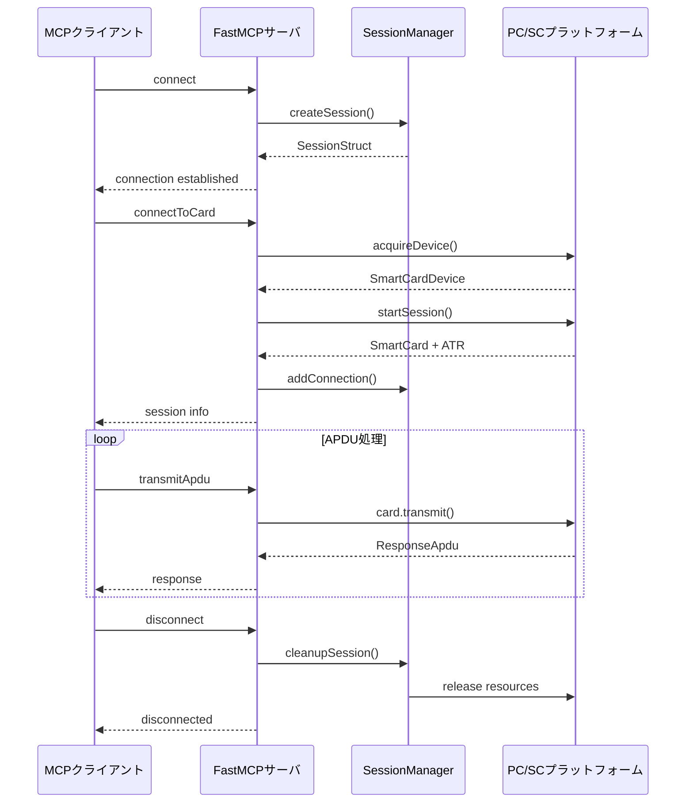
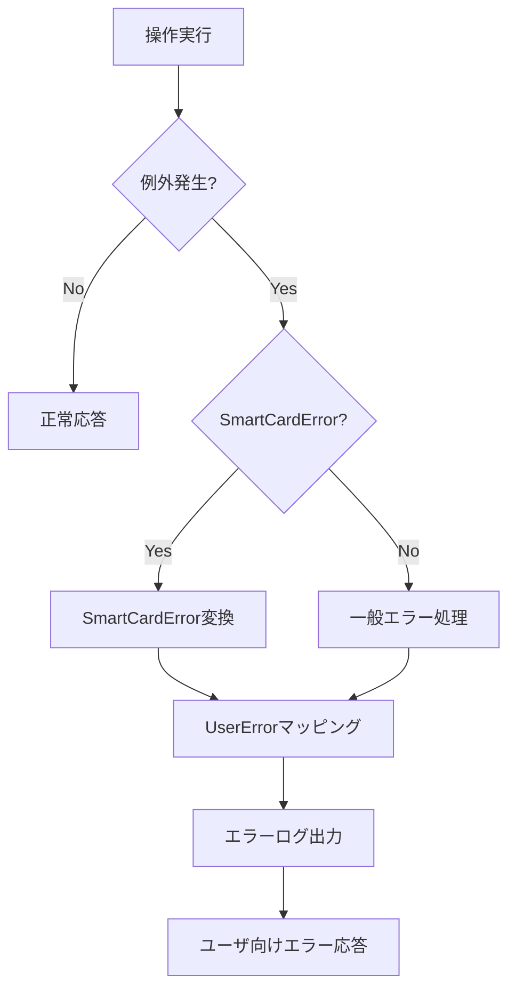
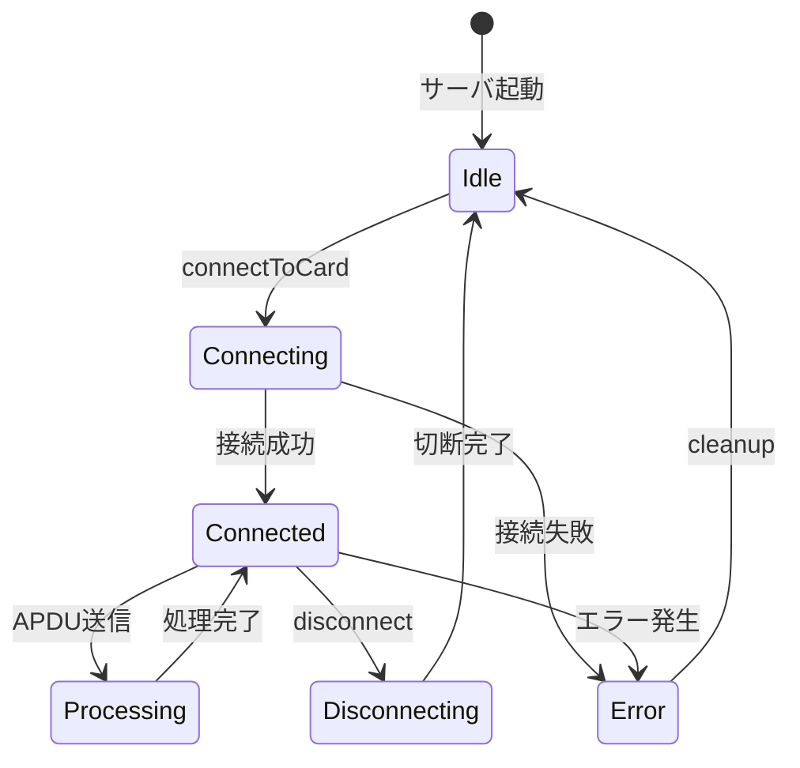

# スマートカードMCPサーバ詳細仕様書

**文書番号:** SCMCP-DET-001  
**版数:** 1.0  
**作成日:** 2025年7月16日  
**作成者:** システム設計チーム  
**レビュアー:** [レビュアー名]  
**承認者:** [承認者名]

---

## 改訂履歴

| 版数 | 改訂日     | 改訂者             | 改訂内容 |
| ---- | ---------- | ------------------ | -------- |
| 1.0  | 2025/07/16 | システム設計チーム | 初版作成 |

---

## 1. 文書概要

### 1.1 目的

本文書は、スマートカードMCPサーバシステムの詳細設計および実装仕様を規定するものである。

### 1.2 対象読者

- システム開発者
- テスト担当者
- 運用担当者
- 保守担当者

### 1.3 関連文書

- スマートカードMCPサーバ要件定義書 (SCMCP-REQ-001)
- FastMCPフレームワーク仕様書
- @aokiappパッケージ仕様書

---

## 2. システム構成詳細

### 2.1 アーキテクチャ概要

```
┌─────────────────────────────────────────────────────────────┐
│                    AI エージェント層                          │
│  ┌─────────────┐  ┌─────────────┐  ┌─────────────┐      │
│  │    Claude   │  │   ChatGPT   │  │   その他    │      │
│  1. **事前バックアップ**
2. **サービス停止**
3. **パッケージ更新**
4. **起動引数確認**
5. **サービス開始**
6. **動作確認**────────┘  └─────────────┘  └─────────────┘      │
└─────────────────────────────────────────────────────────────┘
                              │
                    MCP Protocol (JSON-RPC 2.0)
                              │
┌─────────────────────────────────────────────────────────────┐
│               FastMCP フレームワーク層                        │
│  ┌─────────────────────────────────────────────────────┐   │
│  │            スマートカードMCPサーバ                    │   │
│  │  ┌─────────┐ ┌─────────┐ ┌─────────┐ ┌─────────┐ │   │
│  │  │ ツール  │ │セッション│ │エラー   │ │ ログ    │ │   │
│  │  │ 管理    │ │ 管理    │ │ ハンドラ│ │ マネージャ│ │   │
│  │  └─────────┘ └─────────┘ └─────────┘ └─────────┘ │   │
│  └─────────────────────────────────────────────────────┘   │
└─────────────────────────────────────────────────────────────┘
                              │
                    @aokiapp Interface Layer
                              │
┌─────────────────────────────────────────────────────────────┐
│                  @aokiapp/pcsc 実装層                        │
│  ┌─────────────────────────────────────────────────────┐   │
│  │          PC/SC プラットフォーム                       │   │
│  │  ┌─────────┐ ┌─────────┐ ┌─────────┐ ┌─────────┐ │   │
│  │  │デバイス │ │カード   │ │トランザ │ │エラー   │ │   │
│  │  │マネージャ│ │マネージャ│ │クション │ │ハンドラ │ │   │
│  │  └─────────┘ └─────────┘ └─────────┘ └─────────┘ │   │
│  └─────────────────────────────────────────────────────┘   │
└─────────────────────────────────────────────────────────────┘
                              │
                      OS PC/SC サービス
                              │
┌─────────────────────────────────────────────────────────────┐
│                   ハードウェア層                              │
│  ┌─────────────┐  ┌─────────────┐  ┌─────────────┐      │
│  │USBリーダ    │  │NFCリーダ    │  │内蔵リーダ   │      │
│  └─────────────┘  └─────────────┘  └─────────────┘      │
└─────────────────────────────────────────────────────────────┘
```

### 2.2 モジュール構成

| モジュール名   | 責務                              | 実装ファイル       |
| -------------- | --------------------------------- | ------------------ |
| FastMCPServer  | MCPサーバ本体、トランスポート管理 | index.ts           |
| ToolRegistry   | ツール登録・管理                  | tools.ts           |
| ErrorHandler   | エラー処理・変換                  | error-handler.ts   |
| LogManager     | ログ出力・管理                    | log-manager.ts     |
| ArgumentParser | 引数解析・設定管理                | argument-parser.ts |

---

## 3. データ仕様

### 3.1 共通データ型定義

#### 3.1.1 ReaderInfo型

```typescript
interface ReaderInfo {
  id: string; // リーダ識別子
  name: string; // リーダ名称
  isAvailable: boolean; // 利用可能フラグ
  hasCard: boolean; // カード挿入フラグ
  description?: string; // リーダ説明
  isIntegrated?: boolean; // 内蔵型フラグ
  isRemovable?: boolean; // 取外し可能フラグ
  supportsApdu?: boolean; // APDU対応フラグ
  supportsHce?: boolean; // HCE対応フラグ
}
```

#### 3.1.2 SessionInfo型

```typescript
interface CardConnectionInfo {
  readerId: string; // 関連リーダID
  connectedAt: Date; // 接続日時
}

type ProtocolType = "T=0" | "T=1" | "T=CL";
```

#### 3.1.3 ApduCommand型

```typescript
interface ApduCommand {
  type: "hex" | "structured";
}

interface HexApduCommand extends ApduCommand {
  type: "hex";
  command: string; // 16進文字列形式APDU
}

interface StructuredApduCommand extends ApduCommand {
  type: "structured";
  cla: number; // クラスバイト (0x00-0xFF)
  ins: number; // 命令バイト (0x00-0xFF)
  p1: number; // パラメータ1 (0x00-0xFF)
  p2: number; // パラメータ2 (0x00-0xFF)
  data?: string; // データ部 (16進文字列)
  le?: number; // 期待応答長 (0-65536)
}
```

#### 3.1.4 ApduResponse型

```typescript
interface ApduResponse {
  success: boolean; // 成功フラグ
  data: string; // 応答データ (16進文字列)
  sw: string; // ステータスワード (4桁16進)
  timing: number; // 実行時間 (ミリ秒)
}
```

### 3.2 エラーコード定義

#### 3.2.1 システムエラーコード

| エラーコード                    | 説明                     | HTTP Stat | ユーザメッセージ                             |
| ------------------------------- | ------------------------ | --------- | -------------------------------------------- |
| SCMCP_E_PLAT_NO_INIT            | プラットフォーム未初期化 | 500       | スマートカードシステムが初期化されていません |
| SCMCP_E_NO_READER               | リーダ未検出             | 404       | スマートカードリーダが見つかりません         |
| SCMCP_E_READER_ERROR            | リーダエラー             | 500       | リーダとの通信でエラーが発生しました         |
| SCMCP_E_SESSION_NOT_ESTABLISHED | セッション未確立         | 400       | カードとの接続が確立されていません           |
| SCMCP_E_CARD_NOT_INSERTED       | カード未挿入             | 400       | カードが挿入されていません                   |
| SCMCP_E_COMMUNICATION_ERROR     | 通信エラー               | 500       | カードとの通信でエラーが発生しました         |
| SCMCP_E_PROTOCOL_ERROR          | プロトコルエラー         | 500       | 通信プロトコルの確立に失敗しました           |
| SCMCP_E_TIMEOUT                 | タイムアウト             | 408       | 操作がタイムアウトしました                   |
| SCMCP_E_RESOURCE_LIMIT          | リソース制限             | 503       | システムリソースが不足しています             |
| SCMCP_E_INVALID_PARAMETER       | 不正パラメータ           | 400       | 入力パラメータが不正です                     |

#### 3.2.2 APDUステータスコード変換表

| ステータス | カテゴリ | 意味             | 推奨アクション       |
| ---------- | -------- | ---------------- | -------------------- |
| 9000       | success  | 正常終了         | 処理継続             |
| 6100       | warning  | 応答データあり   | GET RESPONSEで取得   |
| 6281       | warning  | データ破損可能性 | データ検証実施       |
| 6300       | warning  | 認証失敗         | 認証情報確認         |
| 6400       | error    | 実行エラー       | コマンド見直し       |
| 6700       | error    | 不正長           | データ長確認         |
| 6900       | error    | コマンド不許可   | セキュリティ状態確認 |
| 6A00       | error    | 不正パラメータ   | パラメータ修正       |
| 6B00       | error    | 不正P1/P2        | パラメータ修正       |
| 6C00       | error    | 不正Le           | Le値修正             |
| 6D00       | error    | 未対応命令       | 命令コード確認       |
| 6E00       | error    | 未対応クラス     | クラスバイト確認     |
| 6F00       | error    | データなし       | 前処理確認           |

---

## 4. インターフェース仕様

### 4.1 MCPツール仕様

#### 4.1.1 listReaders

**概要:** システム内の利用可能なスマートカードリーダを列挙する

**入力仕様:**

```json
{}
```

**出力仕様:**

```json
{
  "success": boolean,
  "readers": ReaderInfo[],
  "count": number,
  "timestamp": string  // ISO 8601形式
}
```

**処理フロー:**

1. PC/SCプラットフォーム初期化確認
2. デバイス情報一覧取得 (getDeviceInfo())
3. 各デバイスの状態確認
4. レスポンス構築・返却

**エラー条件:**

- PC/SCサービス未起動
- ドライバ未インストール
- アクセス権限不足

#### 4.1.2 connectToCard

**概要:** 指定リーダのスマートカードとの通信セッションを確立する

**入力仕様:**

```json
{
  "useDefaultReader": boolean,  // デフォルト: true
  "readerId": string           // useDefaultReader=falseの場合必須
}
```

**出力仕様:**

```json
{
  "success": boolean,
  "atr": string,              // 16進文字列
  "protocol": "T=0" | "T=1" | "T=CL",
  "reader": ReaderInfo
}
```

**処理フロー:**

1. リーダID解決 (デフォルト/指定)
2. リーダ利用可能性確認
3. カード存在確認 (isCardPresent())
4. デバイス取得 (acquireDevice())
5. カードセッション開始 (startSession())
6. ATR取得・プロトコル確立
7. セッション情報記録
8. レスポンス構築・返却

**エラー条件:**

- リーダ未検出
- カード未挿入
- 他セッションで使用中
- プロトコルネゴシエーション失敗

#### 4.1.3 disconnectFromCard

**概要:** スマートカードとの通信セッションを終了する

**入力仕様:**

```json
{}
```

**出力仕様:**

```json
{
  "success": boolean,
  "message": string,
  "reader": ReaderInfo  // 省略可能
}
```

**処理フロー:**

1. セッション特定
1. FastMCPのセッション（context.session）からカード接続情報を取得
1. アクティブトランザクション確認
1. カード接続の適切な解放 (card.release())
1. デバイス解放 (device.release())
1. FastMCPのセッション状態を自動的にクリーンアップ
1. レスポンス構築・返却

#### 4.1.4 transmitApdu

**概要:** スマートカードにAPDUコマンドを送信し応答を受信する

**入力仕様 (パターン1):**

```json
{
  "type": "hex",
  "command": string  // APDU16進文字列
}
```

**入力仕様 (パターン2):**

```json
{
  "type": "structured",
  "cla": number,     // 0-255
  "ins": number,     // 0-255
  "p1": number,      // 0-255
  "p2": number,      // 0-255
  "data": string,    // 16進文字列 (省略可能)
  "le": number       // 0-65536 (省略可能)
}
```

**出力仕様:**

```json
{
  "success": boolean,
  "data": string,    // 応答データ16進文字列
  "sw": string,      // 4桁16進ステータス
  "timing": number   // 実行時間(ms)
}
```

**処理フロー:**

1. 入力形式判定・検証
2. APDU構築 (CommandApdu)
3. アクティブセッション取得
4. 実行時間測定開始
5. APDU送信 (card.transmit())
6. 応答受信・解析 (ResponseApdu)
7. 実行時間測定終了
8. レスポンス構築・返却

#### 4.1.5 resetCard

**概要:** スマートカードのハードウェアリセットを実行する

**入力仕様:**

```json
{}
```

**出力仕様:**

```json
{
  "success": boolean,
  "atr": string,              // 新ATR
  "protocol": "T=0" | "T=1" | "T=CL"
}
```

**処理フロー:**

1. アクティブセッション取得
2. カードリセット実行 (card.reset())
3. 新ATR取得 (card.getAtr())
4. プロトコル再確立
5. セッション情報更新
6. レスポンス構築・返却

#### 4.1.6 lookupStatusCode

**概要:** APDUステータスコードを解釈し説明を提供する

**入力仕様:**

```json
{
  "sw": string  // 4桁16進文字列
}
```

**出力仕様:**

```json
{
  "sw": string,
  "category": "success" | "warning" | "error",
  "meaning": string,
  "action": string
}
```

**処理フロー:**

1. ステータスコード正規化
2. ステータステーブル検索
3. カテゴリ判定
4. 説明文・推奨アクション取得
5. レスポンス構築・返却

#### 4.1.7 forceReleaseReader

**概要:** 指定リーダのリソースを強制解放する

**入力仕様:**

```json
{
  "readerId": string
}
```

**出力仕様:**

```json
{
  "success": boolean,
  "message": string,
  "readerId": string
}
```

**処理フロー:**

1. リーダ状態確認
2. 関連セッション特定
3. 強制リソース解放
4. セッション情報クリア
5. 操作ログ記録
6. レスポンス構築・返却

### 4.2 内部API仕様

#### 4.2.1 SessionManager

**クラス名:** SessionManager  
**責務:** MCPクライアントセッションの管理

**メソッド一覧:**

| メソッド名           | 説明               | パラメータ                | 戻り値           |
| -------------------- | ------------------ | ------------------------- | ---------------- |
| createSession        | 新規セッション作成 | clientInfo                | SessionStruct    |
| getSession           | セッション取得     | sessionId                 | SessionStruct    |
| addConnection        | 接続追加           | sessionId, connectionInfo | void             |
| removeConnection     | 接続削除           | sessionId, readerId       | void             |
| cleanupSession       | セッション削除     | sessionId                 | Promise<void>    |
| getActiveConnections | アクティブ接続一覧 | sessionId                 | ConnectionInfo[] |

#### 4.2.2 ErrorHandler

**クラス名:** ErrorHandler  
**責務:** エラー変換・ハンドリング

**メソッド一覧:**

| メソッド名         | 説明               | パラメータ     | 戻り値    |
| ------------------ | ------------------ | -------------- | --------- |
| mapSmartCardError  | SmartCardError変換 | error          | UserError |
| handleUnknownError | 不明エラー処理     | error          | UserError |
| getErrorCode       | エラーコード取得   | error          | string    |
| logError           | エラーログ出力     | error, context | void      |

---

## 5. 処理フロー詳細

### 5.1 セッション管理フロー



### 5.2 エラーハンドリングフロー



### 5.3 リソース管理フロー



---

## 6. 設定仕様

### 6.1 コマンドライン引数

| 引数名              | 説明             | デフォルト値 | 必須 |
| ------------------- | ---------------- | ------------ | ---- |
| --transport-type    | 転送方式         | stdio        | No   |
| --port              | HTTPポート番号   | 8080         | No   |
| --log-level         | ログレベル       | info         | No   |
| --smartcard-timeout | タイムアウト(ms) | 30000        | No   |
| --max-sessions      | 最大セッション数 | 10           | No   |

---

## 7. パフォーマンス仕様

### 7.1 応答時間要件

| 操作               | 目標時間 | 最大時間 | 測定条件        |
| ------------------ | -------- | -------- | --------------- |
| listReaders        | 100ms    | 500ms    | リーダ5台接続時 |
| connectToCard      | 500ms    | 1000ms   | 標準ICカード    |
| transmitApdu       | 50ms     | 100ms    | 標準APDU        |
| disconnectFromCard | 50ms     | 200ms    | -               |
| resetCard          | 1000ms   | 3000ms   | -               |
| lookupStatusCode   | 1ms      | 10ms     | -               |
| forceReleaseReader | 100ms    | 500ms    | -               |

### 7.2 スループット要件

| 項目             | 要件値           |
| ---------------- | ---------------- |
| 同時セッション数 | 最大10セッション |
| APDU処理能力     | 100 APDU/秒      |
| メモリ使用量     | <100MB           |
| CPU使用率        | <5% (待機時)     |

### 7.3 可用性要件

| 項目     | 要件値  |
| -------- | ------- |
| 稼働率   | 99.9%   |
| MTBF     | 720時間 |
| MTTR     | 1時間   |
| 復旧時間 | 30秒    |

---

## 8. セキュリティ仕様

### 8.1 認証・認可

#### 8.1.1 APIキー認証

- リクエストヘッダー: `X-API-Key`
- キー形式: UUID v4
- 有効期限: 設定可能 (デフォルト: 無期限)

#### 8.1.2 OAuth 2.0認証

- 対応フロー: Authorization Code
- スコープ: `smartcard:read`, `smartcard:write`
- JWTトークン検証

### 8.2 データ保護

#### 8.2.1 データ分類

| データ種別     | 機密度       | 保護措置       |
| -------------- | ------------ | -------------- |
| ATR            | Public       | なし           |
| APDU           | Restricted   | ログマスキング |
| セッション情報 | Internal     | メモリ内のみ   |
| 設定情報       | Confidential | 暗号化推奨     |

#### 8.2.2 ログ保護

- 機密データのマスキング
- ログファイルのアクセス制御
- ログローテーション

---

## 9. 運用仕様

### 9.1 監視項目

| 監視項目     | しきい値 | アラート |
| ------------ | -------- | -------- |
| CPU使用率    | >80%     | Warning  |
| メモリ使用量 | >200MB   | Warning  |
| 応答時間     | >2秒     | Critical |
| エラー率     | >5%      | Warning  |
| セッション数 | >8       | Info     |

### 9.2 ログ仕様

#### 9.2.1 ログレベル

- **ERROR**: システムエラー、例外
- **WARN**: 警告、非推奨機能使用
- **INFO**: 重要な操作、状態変更
- **DEBUG**: 詳細トレース情報

#### 9.2.2 ログフォーマット

```
[YYYY-MM-DD HH:mm:ss.fff] [LEVEL] [MODULE] [SESSION] MESSAGE
```

#### 9.2.3 ログ出力例

```
[2025-07-16 23:00:00.123] [INFO] [SESSION] [abc123] Client connected: Claude v1.0
[2025-07-16 23:00:01.456] [INFO] [TOOLS] [abc123] connectToCard: reader1 success
[2025-07-16 23:00:02.789] [DEBUG] [APDU] [abc123] TX: 00A4040000
[2025-07-16 23:00:02.801] [DEBUG] [APDU] [abc123] RX: 9000 (12ms)
[2025-07-16 23:00:10.555] [INFO] [SESSION] [abc123] Client disconnected
```

### 9.3 バックアップ・復旧

#### 9.3.1 バックアップ対象

- 設定ファイル
- ログファイル (ローテーション済み)
- 証明書・キーファイル

#### 9.3.2 復旧手順

1. PC/SCサービス状態確認
2. 設定ファイル復元
3. アプリケーション再起動
4. 動作確認

---

## 10. テスト仕様

### 10.1 単体テスト

#### 10.1.1 テスト対象

- 各ツール機能
- エラーハンドリング
- データ変換処理
- 設定読み込み

#### 10.1.2 テストケース例

| テスト項目            | 入力条件      | 期待結果                |
| --------------------- | ------------- | ----------------------- |
| listReaders\_正常系   | リーダ2台接続 | 2台のリーダ情報取得     |
| connectToCard\_異常系 | カード未挿入  | CARD_NOT_PRESENT エラー |
| transmitApdu\_境界値  | 最大長APDU    | 正常処理                |

### 10.2 結合テスト

#### 10.2.1 テストシナリオ

1. **基本シナリオ**: 接続→APDU→切断
2. **エラーシナリオ**: カード抜去→エラー処理
3. **同時接続シナリオ**: 複数クライアント接続
4. **負荷シナリオ**: 大量APDU処理

### 10.3 システムテスト

#### 10.3.1 性能テスト

- 応答時間測定
- スループット測定
- 負荷耐性確認

#### 10.3.2 セキュリティテスト

- 認証・認可確認
- データ保護確認
- ログ監査

---

## 11. 移行・展開仕様

### 11.1 システム要件

#### 11.1.1 ハードウェア要件

| 項目       | 最小構成   | 推奨構成   |
| ---------- | ---------- | ---------- |
| CPU        | 1コア 1GHz | 2コア 2GHz |
| メモリ     | 512MB      | 2GB        |
| ストレージ | 100MB      | 1GB        |

#### 11.1.2 ソフトウェア要件

| 項目                 | バージョン |
| -------------------- | ---------- |
| Node.js              | 18.0+      |
| PC/SCサービス        | OS標準     |
| カードリーダドライバ | メーカ提供 |

### 11.2 インストール手順

1. **前提条件確認**
   - Node.js バージョン確認
   - PC/SCサービス動作確認
   - カードリーダ認識確認

2. **パッケージインストール**

   ```bash
   npm install smartcard-mcp-server
   ```

3. **引数設定・起動**

   ```bash
   smartcard-mcp --transport-type=stdio --log-level=info --smartcard-timeout=30000
   ```

4. **動作確認**
   ```bash
   npm run test
   npm start
   ```

### 11.3 アップデート手順

1. **事前バックアップ**
2. **サービス停止**
3. **パッケージ更新**
4. **設定引数確認**
5. **サービス開始**
6. **動作確認**

---

## 12. 付録

### 12.1 用語集

| 用語    | 説明                                                        |
| ------- | ----------------------------------------------------------- |
| APDU    | Application Protocol Data Unit - スマートカードとの通信単位 |
| ATR     | Answer To Reset - カードの基本情報                          |
| PC/SC   | Personal Computer/Smart Card - スマートカード通信標準       |
| MCP     | Model Context Protocol - AI エージェント通信プロトコル      |
| FastMCP | MCPサーバ構築用TypeScriptフレームワーク                     |

### 12.2 参考文献

- ISO/IEC 7816-4: Identification cards - Integrated circuit cards - Part 4: Organization, security and commands for interchange
- PC/SC Workgroup Specifications
- FastMCP Documentation
- Model Context Protocol Specification

---

**文書終了**

**承認欄**

| 役割                     | 氏名    | 日付       | 署名 |
| ------------------------ | ------- | ---------- | ---- |
| システムアーキテクト     | [SA名]  | 2025/07/16 |      |
| 開発リーダー             | [DEV名] | 2025/07/16 |      |
| 品質保証                 | [QA名]  | 2025/07/16 |      |
| プロジェクトマネージャー | [PM名]  | 2025/07/16 |      |
