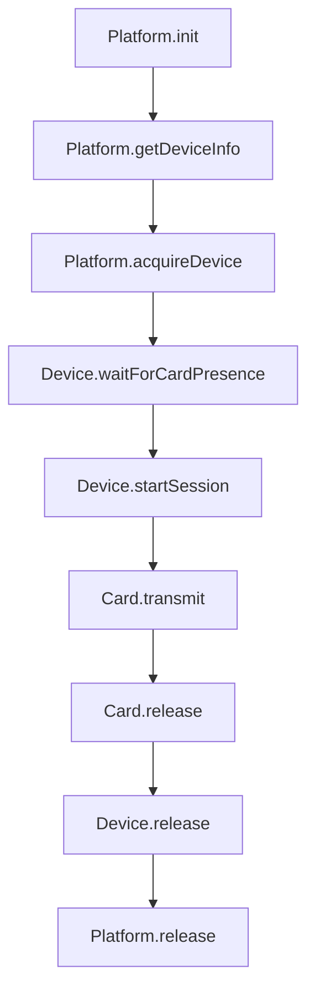

# Android NFC リサーチ第1バッチ サマリ

本書は、インタフェース仕様・PC/SC実装・RN Nitro足場の初期読解結果を集約し、Android実装へのマッピング方針を明文化する。

## 対象・参照

- インタフェース
  - [SmartCardPlatform.class()](packages/interface/src/abstracts.ts:17)
  - [SmartCardPlatform.init()](packages/interface/src/abstracts.ts:33)
  - [SmartCardPlatform.release()](packages/interface/src/abstracts.ts:39)
  - [SmartCardPlatform.getDeviceInfo()](packages/interface/src/abstracts.ts:87)
  - [SmartCardPlatform.acquireDevice()](packages/interface/src/abstracts.ts:103)
  - [SmartCardDevice.class()](packages/interface/src/abstracts.ts:202)
  - [SmartCardDevice.isCardPresent()](packages/interface/src/abstracts.ts:240)
  - [SmartCardDevice.startSession()](packages/interface/src/abstracts.ts:249)
  - [SmartCardDevice.waitForCardPresence()](packages/interface/src/abstracts.ts:259)
  - [SmartCardDevice.release()](packages/interface/src/abstracts.ts:269)
  - [SmartCard.class()](packages/interface/src/abstracts.ts:283)
  - [SmartCard.getAtr()](packages/interface/src/abstracts.ts:293)
  - [SmartCard.transmit()](packages/interface/src/abstracts.ts:300)
  - [SmartCard.reset()](packages/interface/src/abstracts.ts:306)
  - [SmartCard.release()](packages/interface/src/abstracts.ts:312)
- APDU
  - [CommandApdu.class()](packages/interface/src/apdu/command-apdu.ts:5)
  - [ResponseApdu.class()](packages/interface/src/apdu/response-apdu.ts:1)
- エラー型
  - [SmartCardError.class()](packages/interface/src/errors.ts:23)
  - [TimeoutError.class()](packages/interface/src/errors.ts:84)
  - [ValidationError.class()](packages/interface/src/errors.ts:99)

- 参考実装（PC/SC）
  - [PcscPlatform.class()](packages/pcsc/src/platform.ts:31)
  - [PcscDevice.class()](packages/pcsc/src/device.ts:31)
  - [PcscCard.class()](packages/pcsc/src/card.ts:22)
  - セッション開始: [PcscDevice.startSession()](packages/pcsc/src/device.ts:156)
  - カード待機: [PcscDevice.waitForCardPresence()](packages/pcsc/src/device.ts:196)
  - 送受信: [PcscCard.transmit()](packages/pcsc/src/card.ts:61)

- RN Nitro足場
  - [JsapduRn.interface()](packages/rn/src/JsapduRn.nitro.ts:3)
  - [JsapduRn.class()](packages/rn/android/src/main/java/com/margelo/nitro/aokiapp/jsapdurn/JsapduRn.kt:6)
  - [nitro.json](packages/rn/nitro.json:1)
  - [AndroidManifest.xml](packages/rn/android/src/main/AndroidManifest.xml:1)
  - [cpp-adapter.cpp](packages/rn/android/src/main/cpp/cpp-adapter.cpp:1)
  - [JsapduRnPackage.class()](packages/rn/android/src/main/java/com/margelo/nitro/aokiapp/jsapdurn/JsapduRnPackage.kt:1)

## Androidへのマッピング方針（第1バッチ）

- ライフサイクル
  - ReaderModeは [my-requests.md](packages/rn/docs/my-requests.md:32) に従い、[SmartCardPlatform.acquireDevice()](packages/interface/src/abstracts.ts:103) でRFを有効化、[SmartCardDevice.release()](packages/interface/src/abstracts.ts:269) で無効化する。
  - カード検出はイベント駆動を優先し、[SmartCardDevice.waitForCardPresence()](packages/interface/src/abstracts.ts:259) のブロッキング待機はReaderModeのコールバック通知で解除する設計を採る（暫定）。

- I/O規程（IsoDep準拠の反映）
  - タイムアウトはセッション単位で設定・取得し、長時間コマンドに応じて調整する。送信は [SmartCard.transmit()](packages/interface/src/abstracts.ts:300) の契約に従う。
  - 送信可能最大長は実機依存。拡張長APDU可否は動的確認とし、非対応端末では [ValidationError.class()](packages/interface/src/errors.ts:99) で拒否、または [SmartCardError.code](packages/interface/src/errors.ts:23) の「UNSUPPORTED_OPERATION」を使用する。
  - 接続・送受信はメインスレッドで実行しない。ブロッキングI/Oはセッション解放でキャンセル可能とする（[SmartCardDevice.release()](packages/interface/src/abstracts.ts:269)）。

- ATS/ATRの扱い
  - [SmartCard.getAtr()](packages/interface/src/abstracts.ts:293) はISO-DEPのATS（歴史的バイト/上位層レスポンス）取得にマッピングし、PC/SCのATR相当として提供する（詳細は次バッチで補強）。

- エラー写像
  - カード非挿入: [SmartCardError.code](packages/interface/src/errors.ts:23)「CARD_NOT_PRESENT」
  - タイムアウト: [TimeoutError.class()](packages/interface/src/errors.ts:84)
  - 不正引数: [ValidationError.class()](packages/interface/src/errors.ts:99)
  - プラットフォーム障害: [SmartCardError.code](packages/interface/src/errors.ts:23)「PLATFORM_ERROR」

## Mermaidダイアグラム（手順概要）

## 次バッチの調査・反映予定

- ReaderModeフラグ（NFC_A/NFC_B/NFC_F、SKIP_NDEF）、Doze・画面消灯時の挙動の整理
- IsoDepの最大長・拡張長サポートの端末差異の測定計画反映（[compat-devices.md](packages/rn/docs/tsd/compat-devices.md:1)、[length-limits.md](packages/rn/docs/tsd/length-limits.md:1)）
- 権限とGradle設定の明文化（minSdk/targetSdk/compileSdk）（[AndroidManifest.xml](packages/rn/android/src/main/AndroidManifest.xml:1)）

## 受入基準（第1バッチ）

- 本サマリの方針が [android-nfc-rdd.md](packages/rn/docs/rdd/android-nfc-rdd.md:1)、[android-nfc-ddd.md](packages/rn/docs/ddd/android-nfc-ddd.md:1)、[android-nfc-tsd.md](packages/rn/docs/tsd/android-nfc-tsd.md:1) に整合していること
- 次バッチの調査事項が明確に列挙されていること
## FFI中立性の原則（第1バッチ反映）

- 公開API／FFIはOS特有の概念を露出しない。ReaderMode、IsoDep、Intent、Activity等のAndroid特有語は、FFIのメソッド名・引数・戻り値に含めない。契約は [SmartCardPlatform.class()](packages/interface/src/abstracts.ts:17)、[SmartCardDevice.class()](packages/interface/src/abstracts.ts:202)、[SmartCard.class()](packages/interface/src/abstracts.ts:283) の中立用語（RF有効化、カード存在イベント、APDU往復）で定義する。
- Android固有の挙動に関する説明は「実装注意（Android）」として文書内に限定し、FFI公開契約本文には含めない（参照: [android-nfc-tsd.md](packages/rn/docs/tsd/android-nfc-tsd.md:1)、[android-nfc-ddd.md](packages/rn/docs/ddd/android-nfc-ddd.md:1)、[api-contract.md](packages/rn/docs/tsd/api-contract.md:1)）。
- 例外、時間制約、同期規程はプラットフォーム非依存のコード体系に統一する（参照: [SmartCardError.class()](packages/interface/src/errors.ts:23)、[TimeoutError.class()](packages/interface/src/errors.ts:84)）。
- DeviceInfoのAPI識別子は中立名を用いる（例: apduApi=["nfc"]）。OS名はFFIの戻り値に含めず、内部注記（impl=android等）で管理する。
- 用語置換指針: ReaderMode→RF有効化（プラットフォーム内部）、IsoDep→ISO-DEPセッション（プラットフォーム内部）。これらはFFI外の内部設計用語であり、公開契約の一部ではない。
- 将来のiOS実装に対しても同一契約で整合させるため、公開APIはOS非依存の振る舞いを保証する。

上記原則は、本バッチで更新済みの要件・設計・技術仕様に反映済みであり、以降の文書・実装でも継続適用する。