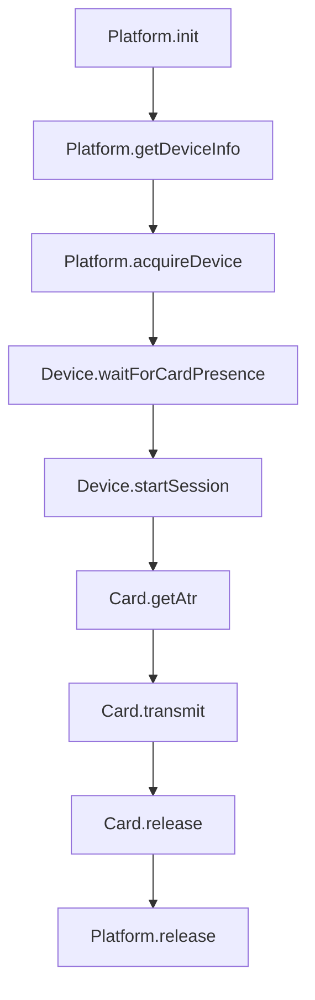

# 実装者向けクイックガイド（5分で把握）

この節は、五月雨式の記述で迷いが出ないよう、最短で実装を成功させるための要点と手順だけを提示します。詳細は既存の各文書へリンクします。

- 目的と範囲
  - ISO-DEPでAPDU往復を提供。NDEFとHCEは初期版の対象外。FeliCaは検出対象に含めるが処理は行わない。
  - 参照: [android-nfc-rdd.md](packages/rn/docs/rdd/android-nfc-rdd.md:16), [android-nfc-rdd.md](packages/rn/docs/rdd/android-nfc-rdd.md:105)

- ホストアプリの前提（忘れがちな必須点）
  - AndroidManifestにNFC権限・機能を宣言する
    - 例（必須端末のみ配布）:
      ```xml
      <manifest xmlns:android="http://schemas.android.com/apk/res/android">
        <uses-permission android:name="android.permission.NFC" />
        <uses-feature android:name="android.hardware.nfc" android:required="true" />
      </manifest>
      ```
    - 例（非NFC端末にも配布）:
      ```xml
      <manifest xmlns:android="http://schemas.android.com/apk/res/android">
        <uses-permission android:name="android.permission.NFC" />
        <uses-feature android:name="android.hardware.nfc" android:required="false" />
      </manifest>
      ```
    - 参照: [android-nfc-tsd.md](packages/rn/docs/tsd/android-nfc-tsd.md:102), [android-nfc-tsd.md](packages/rn/docs/tsd/android-nfc-tsd.md:113)
    - 適用先（例プロジェクト）: [packages/rn/example/android/app/src/main/AndroidManifest.xml](packages/rn/example/android/app/src/main/AndroidManifest.xml:1)
    - デフォルト配布方針: android.hardware.nfc required=false
      - 非NFC端末時の挙動: [SmartCardPlatform.init()](packages/interface/src/abstracts.ts:33) は成功、[SmartCardPlatform.getDeviceInfo()](packages/interface/src/abstracts.ts:87) は0件、[SmartCardPlatform.acquireDevice()](packages/interface/src/abstracts.ts:103) は "PLATFORM_ERROR"。
  - SDKベースライン
    - 最低: minSdk 24（必須）
    - 推奨: targetSdk 34, compileSdk 34（より高い値も許容。例は36）
    - 例の現在設定: [packages/rn/example/android/build.gradle](packages/rn/example/android/build.gradle:3), [packages/rn/example/android/app/build.gradle](packages/rn/example/android/app/build.gradle:78)

- 実装の5ステップ（FFI中立な公開契約準拠）
  1) プラットフォーム初期化 [SmartCardPlatform.init()](packages/interface/src/abstracts.ts:33)
  2) デバイス情報取得 [SmartCardPlatform.getDeviceInfo()](packages/interface/src/abstracts.ts:87) → 現行は統合NFCデバイスを単一IDで返す（受入基準は0または1件）。非NFC端末では0件。将来は複数デバイス（例: BLEリーダ）を許容。IDは例示 "integrated-nfc-0"。apduApi=["nfc","androidnfc"]。supportsHce=false（初期版）。公開スキーマはインタフェース定義に一致させ、追加のケイパは含めない。
  3) デバイス取得でRFを有効化 [SmartCardPlatform.acquireDevice()](packages/interface/src/abstracts.ts:103)
  4) タグ検出の待機 [SmartCardDevice.waitForCardPresence()](packages/interface/src/abstracts.ts:259)（イベント駆動。タイムアウト/キャンセルで終了）
  5) セッション開始とI/O [SmartCardDevice.startSession()](packages/interface/src/abstracts.ts:249), [SmartCard.transmit()](packages/interface/src/abstracts.ts:300), [SmartCard.getAtr()](packages/interface/src/abstracts.ts:293)
     - 終了時はカード→デバイス→プラットフォームの順で解放 [SmartCard.release()](packages/interface/src/abstracts.ts:312), [SmartCardDevice.release()](packages/interface/src/abstracts.ts:269), [SmartCardPlatform.release()](packages/interface/src/abstracts.ts:39)

- ライフサイクルとフラグ（確定方針）
  - ReaderModeフラグ（固定運用）: NFC_A | NFC_B | NFC_F | SKIP_NDEF。端末差による動的切替は行わない。例外端末の回避策は [compat-devices.md](packages/rn/docs/tsd/compat-devices.md:1) に注記。
  - 画面オフ／Doze時: 待機/I/Oをキャンセルし、Deviceを解放。待機側の返却は TIMEOUT。ホストは [SmartCardPlatform.acquireDevice()](packages/interface/src/abstracts.ts:103) → [SmartCardDevice.waitForCardPresence()](packages/interface/src/abstracts.ts:259) を再実行。
  - 参照: [android-nfc-rdd.md](packages/rn/docs/rdd/android-nfc-rdd.md:105), [android-nfc-rdd.md](packages/rn/docs/rdd/android-nfc-rdd.md:109), [nitro-method-conventions.md](packages/rn/docs/nitro-method-conventions.md:67)

- APDU長・拡張長（方針）
- 拡張APDU（Lc/Le二バイト）は検出を行わず常時使用前提。非対応による失敗は [fromUnknownError()](packages/interface/src/errors.ts:115) でラップして "PLATFORM_ERROR" として正規化する。
- 端末上限を超えるLe/Lc指定はエラー（INVALID_PARAMETER）
- 初期版は分割送受信なし
- 参照: [length-limits.md](packages/rn/docs/tsd/length-limits.md:11), [length-limits.md](packages/rn/docs/tsd/length-limits.md:17)

- 受入基準（要点のみ）
  - RF有効化/無効化が契約どおり（acquire/release）に動く
  - 待機は検出成立かTIMEOUTで終了。Doze/画面オフ時はTIMEOUT返却と解放
  - APDU往復はデータ+SW1/2の整合応答を返却。長さ規程および ATR取得順序（Historical Bytes優先→ATS）を遵守
  - 参照: [implementer-checklists.md](packages/rn/docs/implementer-checklists.md:66), [api-contract.md](packages/rn/docs/tsd/api-contract.md:50), [length-limits.md](packages/rn/docs/tsd/length-limits.md:25)

## Errata（参照の統一）

- インタフェース定義の正しいパスは [abstracts.ts](packages/interface/src/abstracts.ts:1) です。  
  [my-requests.md](packages/rn/docs/my-requests.md:20) の「abstract.ts」表記は誤記であり、編集禁止方針のため本索引で補正を周知します。

## キャンセルとタイムアウトの正規化（実装者向け注意）

- 画面オフ／Dozeや明示キャンセルで待機が中断された場合でも、公開契約上は [TimeoutError.class()](packages/interface/src/errors.ts:84)（TIMEOUT）として扱います。
  これはFFI中立性を維持し、エラー写像の一貫性を保つための方針です。該当API: [SmartCardDevice.waitForCardPresence()](packages/interface/src/abstracts.ts:259)
- timeout 引数はミリ秒・任意、省略時は 30000ms（30秒）を既定値とする（[SmartCardDevice.waitForCardPresence()](packages/interface/src/abstracts.ts:259)）。
- timeout が 0 の場合は即時に [TimeoutError.class()](packages/interface/src/errors.ts:84)（TIMEOUT）を返却し、負値の場合は [api-contract.md](packages/rn/docs/tsd/api-contract.md:62) の 'INVALID_PARAMETER' とする。

## 単一情報源の運用（読み手優先）

- 実装行動の基準は [implementer-checklists.md](packages/rn/docs/implementer-checklists.md:1) を最優先とし、本文重複は避けて契約・仕様へリンクします。  
  詳細契約は [api-contract.md](packages/rn/docs/tsd/api-contract.md:1)、技術仕様は [android-nfc-tsd.md](packages/rn/docs/tsd/android-nfc-tsd.md:1)、設計詳細は [android-nfc-ddd.md](packages/rn/docs/ddd/android-nfc-ddd.md:1) を参照してください。
# Android NFC ドキュメント索引

本書は、Android版スマートカードAPDU通信ライブラリ（React Native/Nitro）の文書全体を俯瞰し、実装者が迷わず正しい実装に到達できるようにするための索引と運用指針を提供する。重複や記述揺れを避け、単一の情報源へ誘導する。

## 読み順（Read First）

1. 依頼事項の全体像: [my-requests.md](packages/rn/docs/my-requests.md:1)
2. 実装者チェックリスト（行動指針の単一情報源）: [implementer-checklists.md](packages/rn/docs/implementer-checklists.md:1)
3. 公開API契約（FFI中立の仕様本文）: [api-contract.md](packages/rn/docs/tsd/api-contract.md:1)
4. 技術仕様（時間制約・長さ・例外・スレッド）: [android-nfc-tsd.md](packages/rn/docs/tsd/android-nfc-tsd.md:1)
5. 設計詳細（責務分担・排他制御・イベント処理）: [android-nfc-ddd.md](packages/rn/docs/ddd/android-nfc-ddd.md:1)
6. 要件定義（範囲・非機能・方針）: [android-nfc-rdd.md](packages/rn/docs/rdd/android-nfc-rdd.md:1)

付録（必要時に参照）
- 互換性・端末差異: [compat-devices.md](packages/rn/docs/tsd/compat-devices.md:1)
- APDU長規程: [length-limits.md](packages/rn/docs/tsd/length-limits.md:1)
- 試験計画: [test-plan.md](packages/rn/docs/rdd/test-plan.md:1)
- バックログ: GitHub Issues を参照してください（[Known issues](packages/rn/docs/rdd/test-plan.md:1)も参照）
- リサーチ第1バッチサマリ: [research-batch-1.md](packages/rn/docs/rdd/research-batch-1.md:1)

## 実装者クイックスタート（手順のみ）

詳細はチェックリストの単一情報源へ: [implementer-checklists.md](packages/rn/docs/implementer-checklists.md:1)

- 初期化: [SmartCardPlatform.init()](packages/interface/src/abstracts.ts:33)
- 取得: [SmartCardPlatform.getDeviceInfo()](packages/interface/src/abstracts.ts:87), [SmartCardPlatform.acquireDevice()](packages/interface/src/abstracts.ts:103)
- 待機: [SmartCardDevice.waitForCardPresence()](packages/interface/src/abstracts.ts:259)
- セッション: [SmartCardDevice.startSession()](packages/interface/src/abstracts.ts:249)
- 属性: [SmartCard.getAtr()](packages/interface/src/abstracts.ts:293)
- 送受信: [SmartCard.transmit()](packages/interface/src/abstracts.ts:300)
- 解放: [SmartCard.release()](packages/interface/src/abstracts.ts:312), [SmartCardPlatform.release()](packages/interface/src/abstracts.ts:39)

## API契約チートシート（抜粋）
- 非同期（Promise）
  - [SmartCardPlatform.init()](packages/interface/src/abstracts.ts:33), [SmartCardPlatform.release()](packages/interface/src/abstracts.ts:39), [SmartCardPlatform.getDeviceInfo()](packages/interface/src/abstracts.ts:87), [SmartCardPlatform.acquireDevice()](packages/interface/src/abstracts.ts:103), [SmartCardDevice.isDeviceAvailable()](packages/interface/src/abstracts.ts:231), [SmartCardDevice.isCardPresent()](packages/interface/src/abstracts.ts:240), [SmartCardDevice.waitForCardPresence()](packages/interface/src/abstracts.ts:259), [SmartCardDevice.startSession()](packages/interface/src/abstracts.ts:249), [SmartCard.reset()](packages/interface/src/abstracts.ts:306), [SmartCard.transmit()](packages/interface/src/abstracts.ts:300), [SmartCard.release()](packages/interface/src/abstracts.ts:312)
- 代表的エラー写像（抜粋）
  - NOT_INITIALIZED, ALREADY_INITIALIZED, ALREADY_CONNECTED, CARD_NOT_PRESENT, TIMEOUT, INVALID_PARAMETER, PROTOCOL_ERROR, PLATFORM_ERROR
  - Android I/O例外は一般に PLATFORM_ERROR へ正規化。拡張APDU未対応による失敗は [fromUnknownError()](packages/interface/src/errors.ts:115) でラップして "PLATFORM_ERROR" として正規化する方針。
- APDU長（抜粋）
  - 短長: Lc ≤ 255, Le ≤ 256
  - 拡張: Lc ≤ 65535, Le ≤ 65536
  - 応答理論上限: 65538 bytes（データ+SW1/2）
  - 分割送受信: 初期版は未対応
  - 端末固有上限は [compat-devices.md](packages/rn/docs/tsd/compat-devices.md:1) を参照。規程の詳細は [length-limits.md](packages/rn/docs/tsd/length-limits.md:1)

## 公開契約抜粋（メソッド・引数・戻り値）
- DeviceInfo サンプル（インタフェース準拠）
```json
{
  "id": "integrated-nfc-0",
  "supportsApdu": true,
  "supportsHce": false,
  "isIntegratedDevice": true,
  "isRemovableDevice": false,
  "d2cProtocol": "nfc",
  "p2dProtocol": "nfc",
  "apduApi": ["nfc","androidnfc"]
}
```
- 戻り値例（代表）
  - ResponseApdu: data+SW1/SW2（[ResponseApdu.class()](packages/interface/src/apdu/response-apdu.ts:1)）
- ATR 返却規則（Android）
  - Type A: Historical Bytes が取得できればHB、無ければ ATS（[SmartCard.getAtr()](packages/interface/src/abstracts.ts:293)）
  - Type B: ATSのみ
  - 取得不能条件: null または長さ0 の場合は "PROTOCOL_ERROR"
- 非同期境界（推奨）
  - 非同期（Promise）: [SmartCardPlatform.init()](packages/interface/src/abstracts.ts:33), [SmartCardPlatform.release()](packages/interface/src/abstracts.ts:39), [SmartCardPlatform.getDeviceInfo()](packages/interface/src/abstracts.ts:87), [SmartCardPlatform.acquireDevice()](packages/interface/src/abstracts.ts:103), [SmartCardDevice.isDeviceAvailable()](packages/interface/src/abstracts.ts:231), [SmartCardDevice.isCardPresent()](packages/interface/src/abstracts.ts:240), [SmartCardDevice.waitForCardPresence()](packages/interface/src/abstracts.ts:259), [SmartCardDevice.startSession()](packages/interface/src/abstracts.ts:249), [SmartCard.reset()](packages/interface/src/abstracts.ts:306), [SmartCard.transmit()](packages/interface/src/abstracts.ts:300), [SmartCard.release()](packages/interface/src/abstracts.ts:312)
- 代表的エラー写像（抜粋）
  - NOT_INITIALIZED, ALREADY_INITIALIZED, ALREADY_CONNECTED, CARD_NOT_PRESENT, TIMEOUT, INVALID_PARAMETER, PROTOCOL_ERROR, PLATFORM_ERROR
  - Android I/O例外は一般に PLATFORM_ERROR へ正規化。拡張APDU未対応による失敗は [fromUnknownError()](packages/interface/src/errors.ts:115) でラップして "PLATFORM_ERROR" として正規化する方針。
- APDU長（抜粋）
  - 短長: Lc ≤ 255, Le ≤ 256
  - 拡張: Lc ≤ 65535, Le ≤ 65536
  - 応答理論上限: 65538 bytes（データ+SW1/2）
  - 分割送受信: 初期版は未対応
  - 端末固有上限は [compat-devices.md](packages/rn/docs/tsd/compat-devices.md:1) を参照。規程の詳細は [length-limits.md](packages/rn/docs/tsd/length-limits.md:1)

## 単一情報源（Single Source of Truth）

- 実装行動の基準は [implementer-checklists.md](packages/rn/docs/implementer-checklists.md:1) を唯一の参照とする。
- 公開APIの契約は [api-contract.md](packages/rn/docs/tsd/api-contract.md:1) に集約される。RDD/DDD/TSDは原則として本文の重複を避け、契約へリンクする。
- APDU長と端末上限は [length-limits.md](packages/rn/docs/tsd/length-limits.md:1) と [compat-devices.md](packages/rn/docs/tsd/compat-devices.md:1) に集約する。

## FFI中立性（適用と拡張）

- 中立原則（本文）: [api-contract.md](packages/rn/docs/tsd/api-contract.md:7)
- 中立原則（技術仕様）: [android-nfc-tsd.md](packages/rn/docs/tsd/android-nfc-tsd.md:7)
- 中立原則（設計詳細）: [android-nfc-ddd.md](packages/rn/docs/ddd/android-nfc-ddd.md:5)
- 中立原則（要件定義）: [android-nfc-rdd.md](packages/rn/docs/rdd/android-nfc-rdd.md:5)

Do: 契約で中立語（RF有効化／カード存在イベント／APDU往復）を用いる  
Don’t: ReaderMode／IsoDep／Intent／Activity をFFIに露出しない

DeviceInfoの apduApi は ["nfc","androidnfc"] を返却（Android）。FFI公開では両方を含める。
補足: OS中立性とは、公開FFIにOS固有の語（CoreNFC/ReaderMode/Intent 等）を出さないことであり、OS間で挙動を完全同一にすることを強要するものではない。OS識別はメタデータ（apduApi/将来的な device.os 等）で許容し、ユーザコードに if-platform を強制せず、契約の例外写像と方針で整合を取る。

## Mermaid（エンドツーエンドフロー）



## 重複排除の運用指針

- 仕様の本文は [api-contract.md](packages/rn/docs/tsd/api-contract.md:1) に集約し、RDD/DDD/TSDには本文の繰返しを置かず、契約へのリンクのみを記載する。
- 時間制約・長さ・例外・スレッドは [android-nfc-tsd.md](packages/rn/docs/tsd/android-nfc-tsd.md:1) に集約し、他文書は参照に留める。
- 実装行動（手順・可否・受入基準）は [implementer-checklists.md](packages/rn/docs/implementer-checklists.md:1) に集約する。

## 受入基準（要約）

- RFの有効化／無効化とライフサイクル: [android-nfc-rdd.md](packages/rn/docs/rdd/android-nfc-rdd.md:101)
- スクリーンオフ／Doze時のキャンセルと解放: [android-nfc-rdd.md](packages/rn/docs/rdd/android-nfc-rdd.md:107)
- APDU長規程の遵守: [length-limits.md](packages/rn/docs/tsd/length-limits.md:1)
- 例外写像の一貫性: [api-contract.md](packages/rn/docs/tsd/api-contract.md:62)
- 試験計画の定量達成: [test-plan.md](packages/rn/docs/rdd/test-plan.md:27)

## 改訂管理

- 変更時は必ず本索引と [implementer-checklists.md](packages/rn/docs/implementer-checklists.md:1) を先に更新し、他文書からの本文重複を避ける。
- 路線変更（ReaderModeフラグ／タイムアウト基準／APDU長方針）は契約・仕様・チェックリストの三点セットに同時反映する。