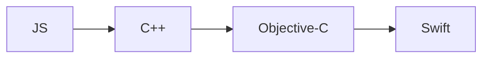
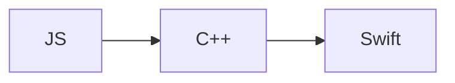

# React Native Nitro Modules 実装ガイド

本書は、packages/rn で使用している React Native Nitro Modules について、Context7での調査結果と既存ボイラープレートの分析から得られた知見を総合的に整理したものです。

## Nitro Modules とは

React Native Nitro Modules は、mrousavy 氏によって開発された新世代の React Native ネイティブモジュール開発フレームワークです。JSI (JavaScript Interface) を基盤として、従来のブリッジベース通信を完全に回避し、JavaScript とネイティブコード間の直接通信を実現します。

### 主な特徴

- **JSI (JavaScript Interface) ベース**: ブリッジを介さない直接通信により大幅なパフォーマンス向上
- **型安全**: TypeScript/Kotlin/Swift での完全に一貫した型定義システム
- **自動コード生成**: nitrogen CLI による platform 固有コードの自動生成
- **HybridObject**: 状態を持つオブジェクトインスタンスの直接共有
- **Promise/async サポート**: ネイティブでの非同期処理の完全サポート
- **ArrayBuffer 操作**: メモリ効率的なバイナリデータ共有
- **カスタムView コンポーネント**: React Native View の拡張サポート
- **Worklets 対応**: react-native-reanimated との統合
- **イベント・コールバック**: JavaScript 関数のネイティブ側での直接実行

## アーキテクチャ比較

### 従来の Turbo Modules vs Nitro Modules

**Turbo Modules の課題:**

- 多層のブリッジング
- 型安全性の欠如
- 複雑な設定
- プロパティサポートの限定

**Nitro Modules の解決:**

- 直接的なJSI連携
- 完全な型安全性
- 自動コード生成
- ネイティブオブジェクトの直接共有

## プロジェクト構造

本プロジェクト（packages/rn）では以下の構造でNitro Modulesを使用しています：

```
packages/rn/
├── nitro.json              # Nitro設定ファイル
├── src/
│   ├── JsapduRn.nitro.ts  # TypeScript インターフェース定義
│   └── index.tsx          # JS エクスポート
├── android/
│   ├── build.gradle       # Android ビルド設定
│   └── src/main/
│       ├── cpp/cpp-adapter.cpp          # JNI アダプター
│       └── java/.../JsapduRn.kt         # Kotlin 実装
├── ios/
│   └── JsapduRn.swift     # Swift 実装
└── nitrogen/              # 生成ファイル（実行後に作成）
    └── generated/
        ├── android/
        ├── ios/
        └── shared/
```

## 設定ファイル: nitro.json

[`nitro.json`](packages/rn/nitro.json) はNitro Modulesの中心的な設定ファイルです：

```json
{
  "cxxNamespace": ["aokiapp_jsapdurn"],
  "ios": {
    "iosModuleName": "JsapduRn"
  },
  "android": {
    "androidNamespace": ["aokiapp","jsapdurn"],
    "androidCxxLibName": "aokiapp_jsapdurn"
  },
  "autolinking": {
    "JsapduRn": {
      "swift": "JsapduRn",
      "kotlin": "JsapduRn"
    }
  }
}
```

- **cxxNamespace**: C++側のネームスペース
- **androidNamespace**: Androidの Java/Kotlin パッケージ構造
- **autolinking**: プラットフォーム別のクラス名マッピング

## TypeScript インターフェース定義

[`src/JsapduRn.nitro.ts`](packages/rn/src/JsapduRn.nitro.ts) では HybridObject を継承したインターフェースを定義します：

```typescript
import type { HybridObject } from 'react-native-nitro-modules';

export interface JsapduRn
  extends HybridObject<{ ios: 'swift'; android: 'kotlin' }> {
  multiply(a: number, b: number): number;
}
```

- **HybridObject**: Nitro Modulesの基底インターフェース
- **プラットフォーム指定**: `{ ios: 'swift'; android: 'kotlin' }` で実装言語を明示

## コード生成とHybridSpec

`nitrogen` ツールが TypeScript インターフェースから各プラットフォーム用のコードを生成します：

- **Android**: `HybridJsapduRnSpec` クラス（Kotlin）
- **iOS**: `HybridJsapduRnSpec` クラス（Swift）
- **C++**: JNI バインディングコード

## Android 実装

[`android/src/main/java/.../JsapduRn.kt`](packages/rn/android/src/main/java/com/margelo/nitro/aokiapp/jsapdurn/JsapduRn.kt):

```kotlin
package com.margelo.nitro.aokiapp.jsapdurn
  
import com.facebook.proguard.annotations.DoNotStrip

@DoNotStrip
class JsapduRn : HybridJsapduRnSpec() {
  override fun multiply(a: Double, b: Double): Double {
    return a * b
  }
}
```

- **@DoNotStrip**: R8/ProGuard でのコード除去を防ぐ
- **HybridJsapduRnSpec**: 生成された基底クラスを継承

### JNI アダプター

[`android/src/main/cpp/cpp-adapter.cpp`](packages/rn/android/src/main/cpp/cpp-adapter.cpp):

```cpp
#include <jni.h>
#include "aokiapp_jsapdurnOnLoad.hpp"

JNIEXPORT jint JNICALL JNI_OnLoad(JavaVM* vm, void*) {
  return margelo::nitro::aokiapp_jsapdurn::initialize(vm);
}
```

## iOS 実装

[`ios/JsapduRn.swift`](packages/rn/ios/JsapduRn.swift):

```swift
class JsapduRn: HybridJsapduRnSpec {
    public func multiply(a: Double, b: Double) throws -> Double {
        return a * b
    }
}
```

## JavaScript エクスポート

[`src/index.tsx`](packages/rn/src/index.tsx):

```typescript
import { NitroModules } from 'react-native-nitro-modules';
import type { JsapduRn } from './JsapduRn.nitro';

const JsapduRnHybridObject =
  NitroModules.createHybridObject<JsapduRn>('JsapduRn');

export function multiply(a: number, b: number): number {
  return JsapduRnHybridObject.multiply(a, b);
}
```

- **NitroModules.createHybridObject**: ネイティブオブジェクトのインスタンス作成
- **型パラメータ**: TypeScript での型安全性を確保

## ビルド設定

### Android (build.gradle)

[`android/build.gradle`](packages/rn/android/build.gradle) の重要な設定：

```gradle
apply from: '../nitrogen/generated/android/aokiapp_jsapdurn+autolinking.gradle'
```

- **nitrogen生成ファイル**: autolinking の設定が含まれる
- **namespace**: `com.margelo.nitro.aokiapp.jsapdurn`

### package.json

[`package.json`](packages/rn/package.json) の重要な設定：

```json
{
  "devDependencies": {
    "nitrogen": "^0.31.1",
    "react-native-nitro-modules": "^0.31.1"
  },
  "scripts": {
    "nitrogen": "nitrogen"
  },
  "react-native-builder-bob": {
    "targets": [
      [
        "custom",
        {
          "script": "nitrogen",
          "clean": "nitrogen/"
        }
      ]
    ]
  }
}
```

## 高度な機能（Context7調査結果）

### 1. 非同期処理とPromise

Nitro Modules は Promise ベースの非同期処理を完全サポートします：

```typescript
interface ImageProcessor extends HybridObject {
  processImage(path: string): Promise<ArrayBuffer>
  calculateFibonacci(n: number): Promise<bigint>
}
```

**Swift実装**:
```swift
class HybridImageProcessor : HybridImageProcessorSpec {
  func processImage(path: String) -> Promise<ArrayBuffer> {
    return Promise.async {
      let image = try await UIImage.load(from: path)
      let processed = try await self.applyFilters(image)
      return ArrayBuffer.copy(data: processed.pngData()!)
    }
  }
}
```

### 2. ArrayBuffer とバイナリデータ

効率的なバイナリデータ共有が可能：

```typescript
const editor = NitroModules.createHybridObject<ImageEditor>('ImageEditor')
const buffer = editor.createBuffer(1024)
const processedBuffer = editor.processBuffer(buffer)
```

**Swift でのArrayBuffer操作**:
```swift
func createBuffer(size: Double) throws -> ArrayBuffer {
  let buffer = ArrayBuffer.allocate(size: Int(size))
  let data = buffer.data
  // Initialize with data
  for i in 0..<Int(size) {
    data[i] = UInt8(i % 256)
  }
  return buffer
}
```

### 3. カスタム構造体

TypeScript で定義した構造体をそのまま使用：

```typescript
interface Person {
  name: string
  age: number
}

interface Car {
  year: number
  make: string
  model: string
  driver: Person
  passengers: Person[]
}

interface CarDatabase extends HybridObject {
  saveCar(car: Car): void
  getCar(id: string): Car | undefined
  getAllDrivers(): Person[]
}
```

### 4. イベント・コールバック

JavaScript 関数をネイティブ側で直接実行：

```typescript
interface DeviceInfo extends HybridObject {
  listenToOrientation(onChanged: (orientation: 'portrait' | 'landscape') => void): void
  requestPermission(
    onSuccess: () => void,
    onFailure: (error: Error) => void
  ): void
}
```

**Swift実装**:
```swift
func listenToOrientation(onChanged: @escaping (Orientation) -> Void) {
  NotificationCenter.default.addObserver(forName: UIDevice.orientationDidChangeNotification) { _ in
    let orientation = UIDevice.current.orientation.isLandscape ? Orientation.landscape : Orientation.portrait
    onChanged(orientation)
  }
}
```

### 5. カスタム View コンポーネント

React Native View の拡張も可能：

```typescript
interface CameraProps extends HybridViewProps {
  enableFlash: boolean
  zoom: number
  onCaptured: (image: ArrayBuffer) => void
}

interface CameraMethods extends HybridViewMethods {
  takePhoto(): Promise<ArrayBuffer>
  startRecording(): void
  stopRecording(): Promise<string>
}

export type CameraView = HybridView<CameraProps, CameraMethods>
```

### 6. Worklets 対応

react-native-reanimated との完全統合：

```typescript
const math = NitroModules.createHybridObject<Math>('Math')
const boxed = NitroModules.box(math)

runOnUI(() => {
  'worklet'
  const unboxed = boxed.unbox()
  const result = unboxed.add(10, 20)
})()
```

## 開発ワークフロー

### 1. プロジェクト初期化
```bash
npx nitrogen@latest init react-native-jsapdu
# または
npx create-nitro-module@latest
```

### 2. 依存関係のインストール
```bash
npm install react-native-nitro-modules --save-dev
npm install nitrogen --save-dev
cd ios && pod install
```

### 3. 開発サイクル
1. **TypeScript インターフェース定義**: [`JsapduRn.nitro.ts`](packages/rn/src/JsapduRn.nitro.ts) でメソッドを定義
2. **コード生成**: `npx nitrogen` で platform 固有のコードを生成
3. **ネイティブ実装**: 生成された Spec クラスを継承して実装
4. **JavaScript エクスポート**: [`index.tsx`](packages/rn/src/index.tsx) でユーザー向けAPIを定義

### 4. ビルド統合

**iOS (Podspec)**:
```ruby
Pod::Spec.new do |s|
  s.source_files = [ ... ]
  load 'nitrogen/generated/ios/JsapduRn+autolinking.rb'
  add_nitrogen_files(s)
end
```

**Android (build.gradle)**:
```gradle
apply from: '../nitrogen/generated/android/aokiapp_jsapdurn+autolinking.gradle'
```

## 実装時の注意点

### 命名規約
- **TypeScript**: `JsapduRn` (PascalCase)
- **Kotlin**: `JsapduRn` (PascalCase)
- **Swift**: `JsapduRn` (PascalCase)
- **Package**: `com.margelo.nitro.aokiapp.jsapdurn`

### ProGuard/R8 対応
Kotlinクラスには `@DoNotStrip` アノテーションが必要：

```kotlin
@DoNotStrip
class JsapduRn : HybridJsapduRnSpec() {
  // implementation
}
```

### エラーハンドリング
- **Kotlin**: 例外をスローすることで JS 側にエラーを伝達
- **Swift**: `throws` キーワードで例外対応
- **自動メモリ管理**: JavaScript 関数の参照は自動的に管理される

### 型安全性
- **コンパイル時チェック**: TypeScript → Native の完全な型検証
- **ランタイム検証**: 不正な型変換は自動的にエラーになる
- **null safety**: Optional 型の適切な処理

## 本プロジェクトでの応用

このボイラープレートを基に、Android NFC 機能を実装する際は：

1. [`JsapduRn.nitro.ts`](packages/rn/src/JsapduRn.nitro.ts) で SmartCard API インターフェースを定義
2. [`JsapduRn.kt`](packages/rn/android/src/main/java/com/margelo/nitro/aokiapp/jsapdurn/JsapduRn.kt) で Android NFC API (ReaderMode, IsoDep) を使用した実装
3. [`index.tsx`](packages/rn/src/index.tsx) で [SmartCardPlatform](packages/interface/src/abstracts.ts:17)/[SmartCardDevice](packages/interface/src/abstracts.ts:202)/[SmartCard](packages/interface/src/abstracts.ts:283) の統一インターフェースを提供

このアーキテクチャにより、高性能かつ型安全なクロスプラットフォーム NFC ライブラリが実現できます。

## 本プロジェクトでの応用

### Android NFC ライブラリ実装戦略

このボイラープレートを基に、Android NFC 機能を実装する際の具体的なアプローチ：

#### 1. インターフェース定義の拡張

[`JsapduRn.nitro.ts`](packages/rn/src/JsapduRn.nitro.ts) を以下のように拡張：

```typescript
import type { HybridObject } from 'react-native-nitro-modules';

export interface JsapduRn extends HybridObject<{ ios: 'swift'; android: 'kotlin' }> {
  // SmartCardPlatform methods
  initPlatform(): Promise<void>
  releasePlatform(): Promise<void>
  getDeviceInfo(): Promise<DeviceInfo[]>
  acquireDevice(deviceId: string): Promise<SmartCardDevice>

  // SmartCardDevice methods
  waitForCardPresence(timeout?: number): Promise<void>
  startSession(): Promise<SmartCard>
  isCardPresent(): Promise<boolean>
  releaseDevice(): Promise<void>

  // SmartCard methods
  getAtr(): Promise<ArrayBuffer>
  transmit(apdu: ArrayBuffer): Promise<ResponseApdu>
  reset(): Promise<void>
  releaseCard(): Promise<void>
}

interface DeviceInfo {
  id: string
  supportsApdu: boolean
  supportsHce: boolean
  isIntegratedDevice: boolean
  isRemovableDevice: boolean
  d2cProtocol: string
  p2dProtocol: string
  apduApi: string[]
}

interface ResponseApdu {
  data: ArrayBuffer
  sw1: number
  sw2: number
}
```

#### 2. Kotlin でのAndroid NFC実装

[`JsapduRn.kt`](packages/rn/android/src/main/java/com/margelo/nitro/aokiapp/jsapdurn/JsapduRn.kt) での実装例：

```kotlin
@DoNotStrip
class JsapduRn : HybridJsapduRnSpec() {
  private var nfcAdapter: NfcAdapter? = null
  private var currentTag: Tag? = null
  private var isoDep: IsoDep? = null
  
  override fun initPlatform(): Promise<Unit> = Promise.async {
    val context = reactContext
    nfcAdapter = NfcAdapter.getDefaultAdapter(context)
    if (nfcAdapter == null) {
      throw Exception("NFC not supported")
    }
  }

  override fun waitForCardPresence(timeout: Double?): Promise<Unit> = Promise.async {
    // ReaderMode implementation
    val flags = NfcAdapter.FLAG_READER_NFC_A or 
                NfcAdapter.FLAG_READER_NFC_B or
                NfcAdapter.FLAG_READER_SKIP_NDEF_CHECK
    
    nfcAdapter?.enableReaderMode(
      currentActivity,
      { tag -> 
        currentTag = tag
        // Notify completion
      },
      flags,
      null
    )
  }

  override fun transmit(apdu: ArrayBuffer): Promise<ResponseApdu> = Promise.async {
    val command = apdu.data
    val response = isoDep?.transceive(command) 
      ?: throw Exception("Card not connected")
    
    // Parse response (data + SW1/SW2)
    val dataLen = response.size - 2
    val data = response.copyOfRange(0, dataLen)
    val sw1 = response[dataLen].toInt() and 0xFF
    val sw2 = response[dataLen + 1].toInt() and 0xFF
    
    ResponseApdu(ArrayBuffer.copy(data), sw1, sw2)
  }
}
```

#### 3. 統合インターフェースの提供

[`index.tsx`](packages/rn/src/index.tsx) で [SmartCardPlatform](packages/interface/src/abstracts.ts:17) / [SmartCardDevice](packages/interface/src/abstracts.ts:202) / [SmartCard](packages/interface/src/abstracts.ts:283) の統一インターフェースを実装：

```typescript
import { NitroModules } from 'react-native-nitro-modules';
import type { JsapduRn } from './JsapduRn.nitro';
import { SmartCardPlatform, SmartCardDevice, SmartCard } from '@aokiapp/jsapdu-interface';

const jsapduRn = NitroModules.createHybridObject<JsapduRn>('JsapduRn');

class NitroSmartCardPlatform implements SmartCardPlatform {
  async init(): Promise<void> {
    return jsapduRn.initPlatform();
  }

  async getDeviceInfo(): Promise<DeviceInfo[]> {
    return jsapduRn.getDeviceInfo();
  }

  async acquireDevice(deviceId: string): Promise<SmartCardDevice> {
    await jsapduRn.acquireDevice(deviceId);
    return new NitroSmartCardDevice();
  }
}

class NitroSmartCardDevice implements SmartCardDevice {
  async waitForCardPresence(timeout?: number): Promise<void> {
    return jsapduRn.waitForCardPresence(timeout);
  }

  async startSession(): Promise<SmartCard> {
    await jsapduRn.startSession();
    return new NitroSmartCard();
  }
}

export const platform = new NitroSmartCardPlatform();
```

### 利点とベストプラクティス

#### パフォーマンス最適化
- **直接メモリアクセス**: ArrayBuffer による効率的なAPDU転送
- **非同期処理**: Promise による UI ブロックの回避
- **ガベージコレクション最適化**: ネイティブオブジェクトの適切な管理

#### エラーハンドリング戦略
```typescript
// FFI中立なエラーマッピング
try {
  const response = await card.transmit(apduBuffer);
} catch (error) {
  if (error.code === 'PLATFORM_ERROR') {
    // Android TagLostException → PLATFORM_ERROR
    console.log('Card removed during operation');
  }
}
```

#### 型安全性の活用
- **コンパイル時チェック**: TypeScript インターフェースによる厳密な型検証
- **ランタイム保証**: Nitro による自動的な型変換とバリデーション
- **プラットフォーム抽象化**: OS固有詳細の隠蔽

### まとめ

Nitro Modules アーキテクチャにより実現される利点：

1. **高性能**: JSI直接通信による低レイテンシAPDU転送
2. **型安全**: TypeScript から Native まで一貫した型システム
3. **保守性**: 自動生成コードによる実装ミスの削減
4. **拡張性**: 将来のiOS対応時の最小限の追加実装
5. **FFI中立**: プラットフォーム固有概念の適切な抽象化

この設計により、Android NFC の複雑さを隠蔽しつつ、高性能かつ型安全なクロスプラットフォーム APDU 通信ライブラリが実現できます。

## 参考資料

- [React Native Nitro 公式ドキュメント](https://nitro.margelo.com)
- [nitrogen CLI ツール](https://github.com/mrousavy/nitro)
- [Context7 Nitro Modules ドキュメント](/mrousavy/nitro)
- [既存ボイラープレートコード](packages/rn)
- [JSI (JavaScript Interface) 仕様](https://github.com/facebook/react-native/blob/main/ReactCommon/jsi)